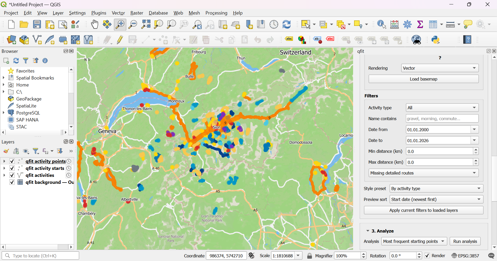

# qfit

Explore fitness activity data spatially in QGIS.

qfit is a QGIS plugin that turns synced fitness activities into GeoPackage-backed layers, analysis views, and atlas-ready publish data for mapping and print workflows.



*qfit in QGIS, showing synced activity tracks and points with the plugin dock open.*

This README is split into two parts:

1. **Part 1, for human readers** using qfit in QGIS
2. **Part 2, for contributors and AI coding agents** changing the codebase

---

## Part 1, for human readers

### What qfit does today

qfit currently supports:

- connecting to Strava with `client_id`, `client_secret`, and `refresh_token`
- opening the Strava authorize page from the plugin and exchanging an auth code for a refresh token
- fetching activities from Strava in the background
- previewing fetched activities in the dock before writing anything to disk
- storing a canonical local GeoPackage sync store
- loading QGIS layers for tracks, start points, and optional sampled stream points
- filtering by activity type, text search, date range, distance, and detailed-stream availability
- applying visualization presets, optional temporal wiring, and an optional Mapbox basemap
- running analysis workflows such as frequent starting points and activity heatmaps
- generating atlas-ready publish layers and exporting a PDF atlas from the dock

### Main outputs

qfit uses a GeoPackage as both local sync store and QGIS data source.

**Internal tables**
- `activity_registry`
- `sync_state`

**Visible layers**
- `activity_tracks`
- `activity_starts`
- `activity_points` (optional, derived from detailed streams)
- `activity_atlas_pages`

**Atlas helper tables**
- `atlas_document_summary`
- `atlas_cover_highlights`
- `atlas_page_detail_items`
- `atlas_toc_entries`
- `atlas_profile_samples`

### Typical workflow

1. Configure Strava credentials.
2. Fetch activities and preview the result in the dock.
3. Choose an output `.gpkg` and store the data.
4. Load the qfit layers into QGIS.
5. Apply visualization or analysis workflows.
6. Optionally generate atlas-ready publish data and export a PDF atlas.

### Strava credentials

You need:

- `client_id`
- `client_secret`
- `refresh_token`

qfit includes a built-in OAuth helper in `qfit` → `Configuration` for the refresh-token step.

See:
- `docs/strava-setup.md`

### Background maps and styling

qfit can load an optional Mapbox basemap and keep it below the qfit layers in the QGIS layer tree.

The current visualization flow supports:

- semantic activity styling by activity type
- simpler line-based presets
- track points / start points / heatmap-oriented views
- temporal timestamp wiring when timestamp fields are available

See:
- `docs/map-style-guide.md`

### Publish and atlas support

qfit can generate atlas-ready layers and helper tables for print layouts, then export a PDF atlas from the plugin.

The current publish flow supports:

- atlas page extent planning
- cover and summary helper tables
- TOC-ready helper rows
- route-profile sample tables for layout charts
- programmatic PDF export through the atlas/export subsystem

For validation notes and rendering-sensitive workflow details, see:
- `docs/atlas-validation-harness.md`

### More docs

- `docs/strava-setup.md`
- `docs/schema.md`
- `docs/map-style-guide.md`
- `docs/qgis-testing.md`

---

## Part 2, for contributors and AI coding agents

### Read these first

If you are changing internals, start here:

- `CONTRIBUTING.md`
- `docs/architecture.md`
- `docs/qgis-plugin-architecture-principles.md`
- `docs/refactoring-roadmap.md`
- `docs/qgis-testing.md`
- `docs/atlas-validation-harness.md` for rendering/export-sensitive work

### Current architecture snapshot

qfit is being evolved as a **modular monolith** with pragmatic **ports-and-adapters** boundaries.

Preferred dependency direction:

```text
UI -> application/workflow -> domain + ports -> infrastructure adapters
```

In practice, that means:

- keep `qfit_dockwidget.py` focused on UI glue
- move workflow orchestration into feature-owned application modules
- keep provider-neutral logic easier to test than QGIS-heavy code
- keep QGIS, Strava, GeoPackage, settings, and PDF assembly details in infrastructure/adapters when that improves clarity
- add ports/gateways only when they earn their keep

### Current repo shape

**Plugin entrypoints and UI host**
- `qfit_plugin.py`
- `qfit_dockwidget.py`
- `qfit_config_dialog.py`
- `qfit_dockwidget_base.ui`

**Feature-owned packages**
- `activities/` for fetch/sync/load workflows and provider-neutral activity logic
- `analysis/` for analysis workflows, request/result shaping, and QGIS-backed analysis adapters
- `atlas/` for publish/export workflows, runtime preparation, and PDF assembly
- `configuration/` for settings, connection status, and dock-settings binding helpers
- `providers/` for provider contracts and Strava-backed adapters
- `ui/` for dock-widget dependency assembly and UI-only coordination helpers
- `visualization/` for render planning, basemap workflows, temporal wiring, and QGIS layer adapters

**Root-level modules**

The top-level Python module layer is now mostly limited to:

- plugin/bootstrap entrypoints
- a few small shared helpers such as `polyline_utils.py`, `time_utils.py`, `mapbox_config.py`, and `qfit_cache.py`
- transitional compatibility shims such as `activity_query.py`, `activity_classification.py`, `models.py`, `activity_storage.py`, and `layer_manager.py` that still exist only to cushion package migration

Rule of thumb:

> Do not add new feature-specific top-level modules.

If new code belongs to one feature, it should usually live under that feature package.

### Current architectural priorities

1. Keep thinning `QfitDockWidget`.
2. Preserve strict feature ownership.
3. Move policy into application/domain while leaving mechanics in adapters.
4. Keep request/result seams explicit where they reduce UI or framework coupling.
5. Delete compatibility shims once in-repo callers are migrated.

### Practical coding rules

- Prefer small, reviewable PR-sized slices.
- Every behavior change needs tests.
- New workflow logic should not accumulate in `QfitDockWidget`.
- Prefer feature-owned modules over generic root-level helpers.
- Prefer explicit request/result dataclasses when they replace long parameter lists or messy widget-state handoff.
- Keep provider-neutral logic free of PyQGIS when practical.
- Rendering/export-sensitive changes need artifact proof, not only green CI.

### Working conventions by area

**activities/**
- `activities/domain/` holds provider-neutral activity logic.
- `activities/application/` owns fetch/sync/load workflows, preview helpers, and task wrappers.
- GeoPackage-backed activity persistence belongs under infrastructure-oriented paths.

**analysis/**
- dock-facing analysis entrypoints are intentionally being thinned behind workflow-oriented application seams
- request building, dispatch, result shaping, and status policy belong in application modules, not in the dock
- QGIS-backed layer creation stays in analysis infrastructure

**visualization/**
- render planning, temporal intent, and user-facing visualization policy belong in `visualization/application/`
- layer mutation, renderer construction, basemap loading, and QGIS project wiring belong in `visualization/infrastructure/`

**atlas/**
- `atlas/` owns publish/export workflows
- keep naming and ownership crisp across request building, runtime preparation, task execution, and PDF assembly
- avoid adding abstraction layers that do not clarify responsibility

**ui/**
- `ui/` is for dock-widget support code, dependency assembly, UI-only coordination, and similar glue
- UI modules should call workflows and render results, not absorb more business logic

### Testing

Run the main test suite with:

```bash
python3 -m pytest tests/ -x -q --tb=short
```

Run unittest discovery with:

```bash
python3 -m unittest discover -s tests -v
```

Run the PyQGIS smoke test with:

```bash
python3 -m unittest tests.test_qgis_smoke -v
```

On machines without PyQGIS installed, the smoke test skips automatically.

### Local install and packaging

Install qfit into a local QGIS profile for testing with:

```bash
python3 scripts/install_plugin.py --plugins-dir <QGIS plugins dir> --mode copy
```

Build a release-style plugin archive with:

```bash
python -m pip install pypdf
python3 scripts/package_plugin.py
```

The release ZIP is written to `dist/`.

### CI and review expectations

Before treating a change as done:

- run the relevant tests
- keep SonarCloud green
- keep CodeQL/CI green
- address meaningful review feedback
- for export/rendering work, verify the final artifact, not just object construction

### Short version for agents

If you only remember a few rules, remember these:

- make `QfitDockWidget` thinner, not heavier
- keep real feature logic inside feature-owned packages
- keep QGIS-heavy mechanics out of provider-neutral workflow code
- prefer small, behavior-preserving slices
- delete migration shims once callers are gone

## License

GPL-2.0-or-later. See [LICENSE](LICENSE).
