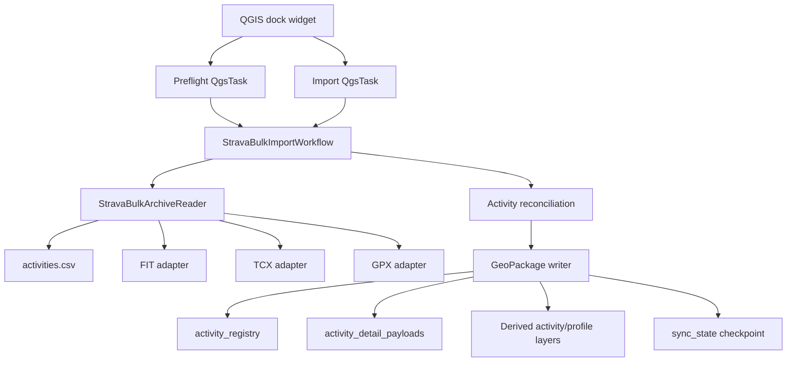

# Strava Bulk Data Export importer: engineering and validation guide

This document is the durable engineering record for the importer delivered by
[issue #1483](https://github.com/ebelo/qfit/issues/1483) and
[pull request #1484](https://github.com/ebelo/qfit/pull/1484). It explains the
design, threat model, implementation workflow, evidence, and review lessons
behind the feature. The shorter [user guide](strava-bulk-import.md) remains the
right starting point for importing an export.

The guide is intentionally specific. A future change should preserve these
invariants or update this document, its tests, and the supporting evidence in
the same pull request.

## 1. Scope and product boundary

The feature imports an athlete's official Strava Bulk Data Export into qfit's
canonical GeoPackage. Its purpose is to seed or refresh historical recorded
activities without spending API quota on years of activity detail.

It is one half of a hybrid model:

- **bulk export import** provides durable historical summaries, exact recorded
  geometry, and point-level metrics when originals are present;
- **regular API synchronization** keeps recent activities current and remains a
  separate workflow; and
- **saved/planned routes** belong to the saved-route workflow and are not
  activities, even when `routes.csv` and GPX files occur in the same export.

`activities.csv` is authoritative for associating an Activity ID with an
original file and for Strava-processed summary values. FIT, TCX, and GPX
originals provide detailed geometry and aligned sample metrics. Filenames are
not inferred from IDs or names.

The archive and GeoPackage remain local. qfit neither uploads them nor imposes
an expiry policy.

## 2. Design principles

The implementation follows six rules:

1. **Allowlist, do not extract.** Inspect the ZIP in place and open only the
   manifest and supported, unambiguous originals it references.
2. **Bound every untrusted input.** Apply count, byte, expansion, parser, and
   compression-ratio limits before or while allocating memory.
3. **Isolate activity failures.** An unsafe archive or manifest stops the run;
   one corrupt original becomes a failed detail result while other activities
   continue.
4. **Separate acquisition from fidelity.** Provenance records where data came
   from; geometry quality decides which representation survives reconciliation.
5. **Commit coherent bounded work.** Parse and write in batches, publish derived
   layers atomically, and claim completion only after publication succeeds.
6. **Prove behavior at three levels.** Pure tests cover deterministic logic,
   real-QGIS Docker tests cover QGIS 3 and 4 integration, and a sanitized private
   export run checks real-world structure without publishing personal data.

## 3. Architecture and ownership

The importer follows qfit's UI -> application -> domain -> infrastructure
direction.



### Module responsibilities

| Module | Responsibility |
|---|---|
| `providers/infrastructure/strava_bulk_archive.py` | ZIP preflight, manifest parsing, imported-member selection, integrity identity, FIT/TCX/GPX normalization |
| `providers/infrastructure/fit_runtime.py` | Load `fitdecode` from the runtime or packaged vendor directory |
| `activities/domain/activity_reconciliation.py` | Provider-neutral merge and geometry-fidelity rules |
| `activities/application/strava_bulk_import.py` | Request/result models, phases, batches, ETA, publication, checkpointing |
| `activities/application/strava_bulk_import_task.py` | Cancellable QGIS background-task adapters |
| `activities/infrastructure/geopackage/gpkg_writer.py` | GeoPackage persistence bridge |
| `activities/infrastructure/geopackage/gpkg_write_orchestration.py` | Bounded, atomic derived-layer rebuild |
| `sync_repository.py` | Canonical registry, compressed details, idempotent upsert, keyset reads, sync state |
| `qfit_dockwidget.py` | File picker, preflight confirmation, task ownership, status, cancellation, completion dialog |
| `ui/dockwidget/sync_page.py` | Sync-page controls and bulk-import action state |
| `scripts/benchmark_strava_bulk_storage.py` | Reproducible storage comparison |
| `scripts/package_plugin.py` and `scripts/install_plugin.py` | Vendor runtime dependencies and licenses |

The archive adapter knows Strava's export schema. Reconciliation deliberately
does not: it compares normalized activity records and can therefore also protect
API-originated detail.

## 4. End-to-end workflow

### 4.1 Preflight

Selecting a ZIP starts a cancellable `StravaBulkPreflightTask`, not work on the
QGIS UI thread. Preflight:

1. validates every central-directory path and normalized-name uniqueness;
2. finds and size-bounds `activities.csv`;
3. streams the manifest into normalized entries and conflict classifications;
4. selects only supported, non-conflicted referenced originals;
5. validates and SHA-256 hashes those members; and
6. returns counts, formats, estimated expanded work, and an archive fingerprint.

The confirmation dialog shows the destination and preflight counts. It does not
write data.

### 4.2 Confirmed import

The confirmed fingerprint is passed in `StravaBulkImportRequest`. The background
import repeats preflight and rejects the run if the archive changed after the
user confirmed it. This closes the time-of-check/time-of-use gap caused by
replacing a ZIP at the same path.

The reader then reopens and rehashes imported members while reporting verified
bytes. Each manifest result is parsed, normalized, reconciled, and accumulated
into a default 25-activity batch. Each committed batch is a coherent restart
point.

After all batches succeed, the workflow rebuilds the visible derived map,
sampled-point, and profile layers through the bounded writer. Only after that
publication succeeds does it create the initial Strava full-history checkpoint
when no existing provider state exists. Existing API sync metadata is preserved.

### 4.3 Progress and ETA

Progress is phase-weighted so a large archive does not appear complete while
layer publication is still running:

| Phase | Display range | Measurement |
|---|---:|---|
| queued | 0% | task waiting |
| validation | 1% | central-directory validation |
| manifest parsing | 3% | manifest read/classification |
| archive integrity | 3–5% | verified imported-member bytes |
| activity parsing/reconciliation | 5–85% | completed manifest rows |
| derived layers | 85–100% | records processed across layer builders |
| complete | 100% | publication and checkpoint complete |

Integrity and layer ETAs use measured byte/record throughput. Activity ETA adds
a 20% allowance for the subsequent rebuild. It is an estimate, not a deadline:
compression, activity format, sample count, storage, and QGIS version all affect
throughput.

### 4.4 Cancellation and recovery

Cancellation is cooperative and checked between read chunks, parser frames or
elements, and activities. Already committed batches remain valid. Cancellation:

- does not roll back earlier coherent batches;
- does not rebuild the visible derived layer set;
- does not write a completion checkpoint; and
- is safely resumed by starting the same import again, because upserts are
  idempotent.

The UI prevents conflicting database, fetch, backfill, store, load, and atlas
actions while a bulk task owns the workflow.

## 5. Archive threat model and resource limits

The ZIP is untrusted input. It may be malformed, adversarial, unexpectedly
large, or replaced between confirmation and import.

### 5.1 Central-directory checks

All members participate in the inexpensive structural checks:

- at most 100,000 members;
- no absolute, drive-qualified, empty, or traversal paths;
- no duplicate paths after slash and POSIX normalization; and
- exactly one safe manifest identity.

The full archive is never extracted.

### 5.2 Imported-member allowlist

Payload checks apply only to data qfit will actually read:

- `activities.csv`; and
- referenced `.fit`, `.fit.gz`, `.tcx`, `.tcx.gz`, `.gpx`, or `.gpx.gz`
  originals belonging to non-conflicted rows.

Unreferenced photos, videos, account files, unsupported referenced formats, and
originals attached only to conflicted rows are not opened or charged against
imported-payload limits. Their presence can still affect manifest result counts.
This distinction matters because an official export may legitimately contain
large unrelated media.

### 5.3 Limits

| Limit | Value | Purpose |
|---|---:|---|
| ZIP members | 100,000 | bound directory work |
| manifest rows | 100,000 | bound activity cardinality |
| generic expanded member | 512 MiB | guard ZIP member reads |
| total imported expanded bytes | 8 GiB | bound selected archive work |
| nested gzip expansion | 512 MiB | reject gzip bombs before parsing |
| `activities.csv` parser input | 32 MiB | bound CSV decoding/materialization |
| FIT parser input | 16 MiB | bound binary parser memory |
| GPX/TCX parser input | 16 MiB | bound XML tree memory |
| compression ratio | 250:1 | reject dangerous expansion |

Limits are enforced from metadata where possible and again while streaming, so
forged metadata cannot bypass them. ZIP encryption and unsupported compression
are rejected for imported members. Reads occur in 1 MiB chunks and honor
cancellation.

### 5.4 Identity and corruption

The archive fingerprint is SHA-256 over the manifest bytes plus the normalized
member identities and SHA-256 payload hashes of imported originals. ZIP CRC is
an integrity signal, not a collision-resistant identity.

If a referenced payload fails ZIP integrity, the reader records a stable
corrupt marker derived from its central-directory metadata. That activity's
manifest summary still imports with failed detail status; intact activities are
not discarded. An unsafe central directory or unreadable manifest still aborts
before writes because the import plan itself cannot be trusted.

### 5.5 XML safety

GPX and TCX use the standard-library parser with a TreeBuilder that rejects any
DOCTYPE declaration. The rejection occurs at the parser callback, covering
UTF-8, UTF-16, leading whitespace, and declarations hidden after long comments.
Payloads are size-bounded before a tree can be materialized.

## 6. Manifest mapping and units

The manifest supplies canonical Strava-processed summaries:

| Manifest field | qfit field | Normalization |
|---|---|---|
| Activity ID | `source_activity_id` | string, with `source = strava` |
| Activity Name | `name` | blank -> null |
| Activity Type | display `activity_type`, API-vocabulary `sport_type` | blank -> member sport metadata or null |
| Activity Date | `start_date_local` | recognized local formats -> ISO local text |
| Distance | `distance_m` | finite float, metres |
| Moving Time | `moving_time_s` | integer seconds |
| Elapsed Time | `elapsed_time_s` | integer seconds |
| Elevation Gain | `total_elevation_gain_m` | finite float, metres |
| Average/Max Speed | `average_speed_mps` / `max_speed_mps` | finite float, m/s |
| Heart rate, watts, calories, relative effort | existing registry summary fields | finite number or null |

The manifest activity type is authoritative. Its display label is retained in
`activity_type` and mapped to Strava's compact API `sport_type` vocabulary so
bulk import and API synchronization produce one qfit route-style category (for
example, `Backcountry Ski` becomes `BackcountrySki`). FIT/TCX sport metadata is
retained as `details_json.bulk_import.member_sport_type` for provenance and only
fills `sport_type` when the manifest value is blank. Unknown useful manifest
columns are retained under versioned `details_json.bulk_summary.values`. Empty
and non-finite numeric values become null.

### Unit validation lesson

The official export schema has generated contradictory third-party claims about
distance units. qfit does not multiply `Distance` by 1,000. This was checked
against the private export used for #1483 without publishing personal rows:

- 2,427 rows contained Distance, Moving Time, and Average Speed;
- `Distance / Moving Time / Average Speed` had median `1.0000009`;
- its 10th–90th percentile range was `0.9997213–1.0002874`;
- archive medians were Distance `3718.7` and Average Speed `1.3425`.

Those dimensions are consistent with metres, seconds, and metres per second.
Multiplying distance by 1,000 would make the audited data physically
impossible. This is also a process lesson: validate a review premise against
source evidence before changing data semantics.

## 7. Normalized activity-detail contract

All format adapters return `ParsedActivityTrack`:

- `geometry_points`: ordered `(latitude, longitude)` pairs;
- `stream_metrics`: arrays aligned by index with geometry;
- `start_date`: UTC timestamp when recoverable; and
- `sport_type`: format-level sport metadata when available.

Metric keys can include time, cumulative distance, altitude, heart rate,
cadence, watts, speed, temperature, grade, and moving state. Missing samples
remain `None`; arrays are not compacted independently because that would attach
measurements to the wrong coordinates.

A usable elevation profile requires at least two samples for which both
distance and altitude are present. Geometry without altitude remains a valid
detailed route and does not get a fabricated profile. The manifest's processed
elevation gain remains the displayed summary; device samples are used to draw
the profile, not to silently replace that summary.

### FIT

- loaded through pure-Python MIT-licensed `fitdecode` 0.11.0;
- semicircle coordinates converted to degrees;
- record messages normalized one coordinate at a time;
- enhanced altitude and enhanced speed preferred over legacy fields;
- timestamp, distance, altitude, heart rate, cadence, power, speed,
  temperature, and grade retained when present; and
- session sport/sub-sport retained as original-member provenance and used for
  `sport_type` only when the manifest activity type is blank.

### TCX

- leading whitespace and XML namespaces supported;
- activity sport metadata retained;
- multiple `Track` elements treated as separate segments; and
- time, distance, altitude, heart rate, cadence, power, and speed normalized.

### GPX

- track points and route points supported;
- multiple track segments and routes preserve segment boundaries;
- time, elevation, heart rate, cadence, power, speed, and temperature retained
  where extensions provide them.

If usable distance samples are missing, qfit derives monotonically cumulative
haversine distance. A new segment begins with zero added gap, so separate tracks
are not connected by an invented straight-line distance.

### Result statuses

| Status | Meaning |
|---|---|
| `detailed_profile` | geometry plus enough aligned distance/altitude samples |
| `detailed_no_altitude` | usable geometry without a genuine profile |
| `no_gps` | parsed or summary activity without usable coordinates |
| `summary_only` | manifest row has no original |
| `unsupported` | referenced original format is outside FIT/TCX/GPX |
| `conflicted` | duplicate/missing identity prevents a safe association |
| `failed` | supported original could not be read or parsed safely |

Conflicts are surfaced rather than guessed. They include missing Activity IDs,
duplicate IDs, duplicate referenced filenames, and missing referenced members.

## 8. Provenance and reconciliation

The stable identity is `(source, source_activity_id)`. For this workflow source
is `strava`; filenames and names are never keys.

Bulk provenance lives in `details_json` and includes:

- `ingest_source = strava_bulk_export` and the accumulated `ingest_sources`;
- bulk schema version;
- archive fingerprint;
- normalized member identity and SHA-256;
- source format and parse status;
- original-member sport metadata when present;
- import timestamp; and
- versioned extra manifest values.

`geometry_source` separately describes precision (`stream`, summary polyline,
or weaker geometry). It is not overloaded with acquisition channel.

Reconciliation fills missing incoming summary fields from the existing record,
merges unrelated detail keys, preserves `first_seen_at`, and selects geometry by
the tuple:

1. geometry rank: exact stream > decodable summary polyline > other usable
   geometry > unusable;
2. genuine profile availability;
3. populated metric-array count; and
4. point count.

Any geometry needs at least two points to be considered usable. An API summary
polyline is decoded for comparison even if `geometry_points` is empty. This
prevents a one-point or lower-detail bulk result from replacing usable API
geometry, while allowing an exact original to replace a summary polyline.

Repeated import of the same archive is unchanged rather than duplicated.
Meaningful new detail updates the row. Volatile timestamps and cache fields do
not manufacture changes.

## 9. Persistence and scale

### 9.1 Canonical summary and detail payload

`activity_registry` remains the canonical indexed summary table. Detailed
geometry and point metrics are serialized once as canonical JSON, compressed
with zlib, and stored in `activity_detail_payloads` using encoding
`json+zlib-v1`, payload SHA-256, point count, and update time.

Readers hydrate both legacy inline JSON and compressed payload rows. Existing
GeoPackages therefore migrate during ordinary writes instead of requiring a
destructive schema conversion. A corrupt compressed payload raises a dedicated
error; a later detailed bulk re-import can repair it from the source original.

### 9.2 Bounded reads and writes

- default import batches contain 25 activities;
- partial batches suppress sync-state mutation and full orphan scans;
- registry iteration uses descending keyset pagination over
  `COALESCE(start_date, ''), source, source_activity_id`, never OFFSET;
- hydrated detail payloads are loaded only for the current key batch; and
- derived tables are rebuilt in bounded batches and swapped/published as a
  coherent set.

The keyset prevents increasingly expensive rescans for large histories and
keeps `_activity_fk` sequencing stable across tied or null dates.

### 9.3 Benchmark and decision

The reproducible command is:

```bash
python3 scripts/benchmark_strava_bulk_storage.py \
  --activities 3000 --points 500 --batch-size 25
```

The 2026-09-21 reference run used 3,000 synthetic activities and 500 points
each, or 1.5 million aligned samples:

| Layout | Write | Peak Python memory | Database | Full reopen |
|---|---:|---:|---:|---:|
| Registry JSON | 29.523 s | 4.49 MiB | 70.79 MiB | 1.375 s |
| `json+zlib-v1` | 36.331 s | 4.47 MiB | 15.56 MiB | 1.225 s |

Compression reduced database size by about 78% with the same bounded Python
working set and a slightly faster full reopen, at the cost of about 23% more
write time. That evidence selected the compressed layout. Absolute results vary
with hardware, SQLite, Python, and sample entropy; the comparative workload is
the durable part of the benchmark.

## 10. Synchronization handoff

Bulk import and API sync share the registry, so completion must leave the sync
planner in a meaningful state.

- Partial batch writes use `suppress_sync_state` and never claim completion.
- After successful derived-layer publication, the workflow records an initial
  full-history `strava_bulk_import` checkpoint only if provider state does not
  already exist.
- Existing API synchronization metadata is not overwritten.
- When an original has no UTC timestamp, `start_date_local` remains a fallback
  for the latest stored activity boundary.

The next API plan can therefore use a bounded incremental overlap after a
summary-only archive instead of assuming no history exists.

## 11. User interface and diagnostics

The sync page exposes **Import Strava export…**. Its flow is file picker ->
background preflight -> confirmation -> background import -> completion.

The confirmation shows activity count, referenced originals, format counts,
summary-only count, conflicts, estimated source work, and destination. The
status area shows phase, percentage, elapsed time, and ETA while QGIS remains
responsive.

Completion reports inserted, updated, unchanged, summary-only, no-GPS,
no-altitude, unsupported, conflicted, failed, total stored, and derived-layer
counts. Copyable detail is deliberately private and redacted: it may include row
number, activity ID, status, and stable reason code, but excludes activity name,
coordinates, source path, and raw parser exception text.

## 12. Packaging and runtime compatibility

Source development and CI install `fitdecode==0.11.0`. Release ZIPs vendor both
`fitdecode` and its license under `qfit/vendor`, just as the existing PDF
runtime dependency is vendored. `fit_runtime.py` tries the normal environment
and packaged vendor path without requiring users to modify QGIS Python.

Both QGIS package profiles must be built and inspected:

```bash
python3 scripts/package_plugin.py --qgis-major 3
python3 scripts/package_plugin.py --qgis-major 4
```

Package tests assert that the module and license occur in both archives. The
real-QGIS tests also import and exercise `FitReader` in each supported runtime.

## 13. Test and evidence strategy

### Pure tests

The main suites and their roles are:

| Test file | Coverage |
|---|---|
| `tests/test_strava_bulk_archive.py` | allowlist, limits, conflicts, fingerprinting, cancellation, corruption isolation, XML safety, FIT/TCX/GPX normalization, alignment and segments |
| `tests/test_strava_bulk_import_workflow.py` | phase weighting, batching, archive replacement, cancellation, member isolation, reconciliation and payload repair |
| `tests/test_sync_repository.py` | compressed persistence, idempotency, keyset batches, pruning, sync checkpoint and local-date fallback |
| `tests/test_strava_bulk_qgis.py` | real GeoPackage import/reopen/profile/re-import, FIT runtime, QGIS task progress |
| package/CI/security tests | dependency vendoring, licenses, workflow dependencies and packaged-plugin scanning |

Synthetic fixtures contain no athlete data. They reproduce arbitrary
filename-to-ID association, missing and duplicate originals, whitespace and
namespaces, partial metrics, multiple segments, corrupt members, absent GPS or
altitude, and oversized inputs.

### Required commands

```bash
python3 -m pytest tests/ -x -q
scripts/docker_test.sh 3
scripts/docker_test.sh 4
python3 scripts/run_plugin_security_scan.py --qgis-major 3
python3 scripts/run_plugin_security_scan.py --qgis-major 4
```

For #1484 the exact merged head passed:

- 2,763 pure tests, 200 skipped, and 383 subtests;
- 225 passed and 82 skipped in the QGIS 3 image;
- 225 passed and 82 skipped in the QGIS 4 image;
- CodeQL and packaged-plugin security scanning;
- SonarCloud with zero open pull-request issues; and
- exact-head Codex and Greptile review.

### Sanitized real-export validation

A recent private export in the 3,000-activity class was processed end to end.
The validation checked category accounting, FIT/TCX/GPX parsing, metric
alignment, conflicts/failures, SQLite integrity, derived-layer counts, reopen,
and idempotent re-import. It completed without referenced-member failures or
conflicts. Only aggregate counts and distributions were used publicly; no
archive, path, name, ID, timestamp, coordinate, or raw row entered the
repository or review discussion.

## 14. Implementation and review workflow

The feature was delivered as one protected-main pull request with small review
fix commits. The repeatable workflow was:

1. inspect the issue and a private export, then encode observed structures as
   synthetic fixtures;
2. implement the secure reader and normalized adapters before UI integration;
3. implement reconciliation and benchmark persistence alternatives;
4. add the application workflow, QGIS tasks, and dock-widget UI;
5. package the runtime dependency and license for both QGIS profiles;
6. run pure tests, both Docker suites, package builds, security scans, benchmark,
   and sanitized private-export validation;
7. push a reviewable commit and open the PR using a real Markdown body file;
8. poll hosted checks, query SonarCloud's pull-request issues directly, and wait
   for automated review of the exact head;
9. fix or evidence every meaningful review point, then repeat all local and
   hosted gates; and
10. merge only after tests, SonarCloud, CodeQL, security, and exact-head reviews
    were clean, then verify the issue closed and local `main` matched origin.

The tools used were ordinary, reproducible project tools: Git, GitHub CLI,
pytest, Docker, the QGIS 3 and QGIS 4 images, SQLite/GeoPackage inspection,
Python's `tracemalloc` benchmark instrumentation, release-ZIP inspection,
SonarCloud's REST issue endpoint, CodeQL, the packaged-plugin security scan, and
automated Codex/Greptile reviews.

Green CI alone was not considered proof. The packaged artifacts and real output
GeoPackages were opened and inspected, and the private export was validated
without copying its sensitive contents into logs.

## 15. Review findings converted into invariants

The long exact-head review loop materially improved the feature. The durable
lessons are listed here so they are not lost in PR comments.

| Finding | Resolution and lasting invariant |
|---|---|
| XML DTD checks could miss UTF-16 or delayed declarations | Reject DTDs through the parser callback, with encoding and long-prefix regressions |
| ZIP CRC was used as archive identity | Fingerprint imported payload bytes with SHA-256; CRC remains only an integrity mechanism |
| Reopened-archive verification appeared stalled | Report verified bytes and ETA during the second integrity pass |
| Global payload limits charged unrelated media | Apply expensive payload rules only to the imported-member allowlist |
| Unsupported originals consumed import limits | Do not open or charge formats qfit will not parse |
| Conflicted originals consumed import limits | Use one selector that excludes ambiguous rows from all payload validation |
| XML and FIT inputs could overrun parser memory | Enforce 16 MiB format-specific ceilings before and during expansion |
| Manifest rows were bounded but bytes were not | Enforce a 32 MiB manifest ceiling before decoding and while reading |
| TCX tracks were joined across geographic gaps | Preserve each Track as a segment boundary during distance derivation |
| Encoded API summary polylines looked empty | Decode them when comparing fidelity and require at least two usable points |
| Registry batching used increasingly costly OFFSET scans | Use stable descending keyset pagination, including tied and null dates |
| Partial batches repeatedly scanned all detail payloads for orphans | Skip the scan when sync state is suppressed and rows cannot be pruned |
| Successful bulk import did not initialize API sync planning | Write a checkpoint only after derived-layer publication succeeds |
| Summary-only history lacked a UTC boundary | Fall back to the manifest's local start date for sync planning |
| One corrupt ZIP member aborted all activities | Isolate the member, preserve its summary, and continue intact originals |
| A review proposed multiplying Distance by 1,000 | Reject the premise using dimensional analysis over sanitized real-export data |
| Packaging worked in the development environment only | Vendor pinned `fitdecode` and its license into both release profiles and test it in both QGIS runtimes |

The general rule is to turn each accepted review finding into a regression test.
When a finding conflicts with real source evidence, document the evidence and do
not change behavior merely to satisfy the comment.

## 16. Change checklist

Use this checklist for future importer changes:

- [ ] Does the change preserve the manifest as the authoritative ID/file map?
- [ ] Are new inputs allowlisted and bounded before materialization?
- [ ] Does one bad original remain isolated without hiding unsafe archive-level failures?
- [ ] Are metric arrays still index-aligned with geometry?
- [ ] Are segment boundaries preserved when deriving distance?
- [ ] Are provenance and geometry fidelity still separate?
- [ ] Can API and archive records reconcile without geometry downgrade?
- [ ] Is repeated import unchanged/idempotent?
- [ ] Do cancellation and failure avoid false layer publication and checkpoints?
- [ ] Are reads, writes, and rebuilds bounded for multi-thousand-activity histories?
- [ ] Are private diagnostics redacted and public fixtures synthetic?
- [ ] Are runtime dependencies and licenses present in both plugin ZIPs?
- [ ] Do pure tests and both QGIS Docker suites pass?
- [ ] Is SonarCloud at zero open issues, and are exact-head reviews resolved?
- [ ] If data semantics changed, was the claim checked against authoritative or sanitized real-world evidence?

## 17. Related references

- [Strava bulk-import user guide](strava-bulk-import.md)
- [qfit architecture guide](architecture.md)
- [Testing policy](testing-policy.md)
- [Contributing guide](../CONTRIBUTING.md)
- [Issue #1483](https://github.com/ebelo/qfit/issues/1483)
- [Pull request #1484](https://github.com/ebelo/qfit/pull/1484)
- [Parent hybrid synchronization design #1482](https://github.com/ebelo/qfit/issues/1482)
