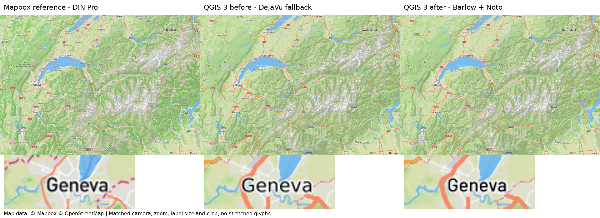
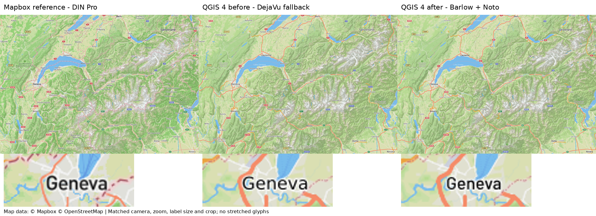
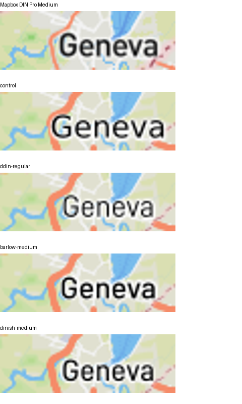
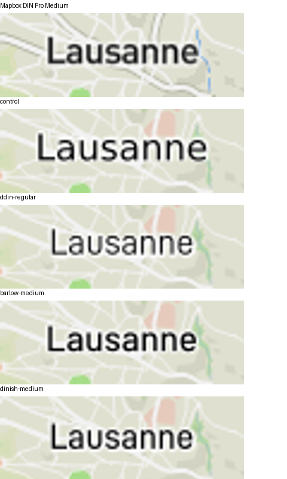

# Open-font comparison evidence for #1453

Runtime mapping: `4887ed0` on `feat/issue-1453-docker-open-fonts`.
The original font-less environment's conversion is the `41898fa` baseline.

## Production before/after

- Same seven Outdoors cameras, saved source style, extent, zoom, output size
  (1280×900), renderer options and Mapbox GL reference in each pair.
- Before: original `qgis/qgis:3.44.11` or `qgis/qgis:4.2.0`, missing Noto Sans;
  Qt resolves the existing Noto request to DejaVu Sans. The new font adapter is
  disabled for this baseline (the base images have no Barlow in any case).
- After: corresponding derived `qfit/qgis:<version>-fonts` image, with pinned
  Barlow Regular/Medium/Italic/Bold and Noto Core, using the production adapter.
- Both camera matrices were rerun against committed runtime code `4887ed0`, running as the unprivileged
  `qfit` user with Noto Core and fontconfig pinned to the verified versions.
  Font and runtime records are in `open-fonts-runtime.json`; full-image metrics
  and reference-image hashes are in `open-fonts-metrics.json`.
- Protected Mapbox access was verified inside each container with HTTP 200,
  authenticated Gateway proxy and verified TLS. The Gateway CA was trusted
  only inside disposable capture containers, not baked into font images.
- Full-map panels are uniformly downscaled to half size. Geneva details are
  identical crops enlarged 4×. No glyph-specific scaling or spacing was used.

Geneva and Lausanne become closer in width/weight and the Geneva shield
collision stays suppressed. Whole-image results are mostly improved, not
universally improved: QGIS 4 Chamonix MAE increases from about 0.03393 to
0.03410; QGIS 3 z17 RMS increases from about 0.02346 to 0.02349. These small
trade-offs are retained transparently, not rounded into claims of perfect
pixel parity. Font shape/weight fidelity, readable labels and cross-runtime
availability are the intended improvement.

## Selecting the open family

These separate host QGIS 3.34 probes alter only the active settlement-major
face. QFontInfo verified every requested family/style; all other label
parameters remain unchanged. D-DIN is the original Datto v1.0 font; DINish
Medium is the static face from upstream commit
`a5f3b2a3b932336225815bf9005e3b72cc3de71c`. Barlow is pinned to Google Fonts
commit `6cdf01867df0813c2390f90dff7dc66c87f14cf7`.

D-DIN Regular is too light and its Bold too heavy for these Medium city
labels. DINish has a real Medium but is also lighter than the reference.
Barlow Medium is the closer of these three candidates in both crops; this is
not a claim that Barlow is universally closer to every DIN font.

Map data © Mapbox © OpenStreetMap. The Mapbox reference uses Mapbox's hosted
font glyphs; no proprietary desktop font files are distributed here.
