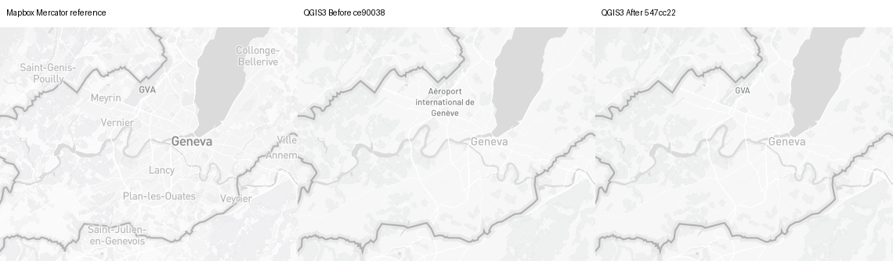
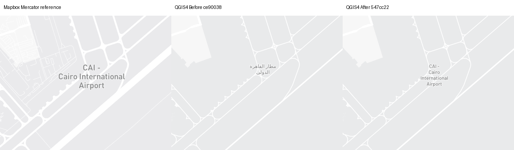
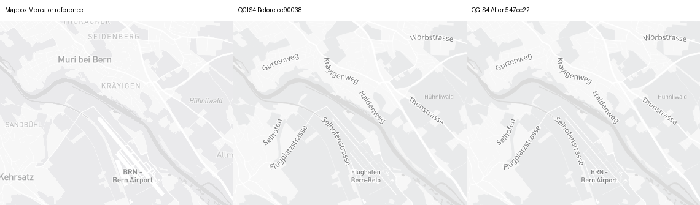
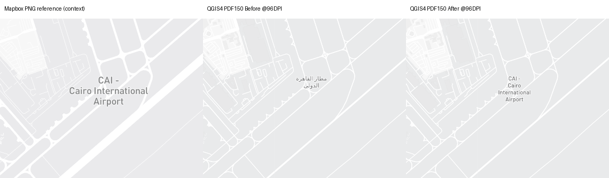

# Light airport code/name content — issue #1462

Fresh captures: **2026-09-15**. Baseline `ce90038949761aa64140a8c49dbb4555c48fe94e`;
candidate `547cc2245b8d73135fc9b0b8dea5d84e66e4b4d1`. Exact source SHA256
`87413e46c074e13aef420958a3ad101961766e6645336608e399ceccaffc6d32` matches the earlier Light snapshot. Live upstream tile
bytes are **not archived**; source equality does not freeze provider data.

## Decision and scope

Retain the exact-Light native airport text correction. The original `sizerank`
step requires `ref` alone at rank15+, otherwise `ref + " -\n" + English/local
name` when a reference exists, or just the English/local name. Missing/NULL
English falls back; empty English and empty reference remain empty strings.
MVT has no explicit NULL property values: a missing ref becomes native NULL.
The numeric source rank is required; missing rank produces no native text.
No generic coalesce-only airport candidate was promoted.

Only the unique source `airport-label` symbol/airport_label/point/no-transform
contract and the native unsplit `airport-label` expression still equal to
`"name"` are adapted, before font-band splitting. The actual source-layer is
`airport_label`. Custom/Outdoors/other roles, explicit text overrides, changed or
duplicate source contracts remain unchanged. All source class/worldview filters,
zoom bounds8+, font/size/anchor/priority/collision settings are preserved.
The source requests an empty icon image: this slice does not add a plane symbol.

**Content, usability, fidelity and output consistency are independent.** The
names/codes now follow the source. Cairoz14 reference error nevertheless rises
0.361710%/0.083258% (QGIS3/4); its native airport name is still too small and
narrowly wrapped. This is OPEN fidelity/typography work, not noise or an accepted
limitation. Source/native style-zoom and density alignment also remain OPEN.

## Representative Before/After maps

Panels: **Mapbox explicit-Mercator reference | QGIS Before ce90038 | QGIS After
547cc22**. Crops are unscaled380×300; top captions are outside the map. Full maps
retain1280×900 per panel. Original source-globe references are retained separately.



Geneva z10: local multi-line airport name becomes source-requested **GVA**.
Crop`(450,380,830,680)`; [full map](geneva-airport-z10-qgis3-full.png).



Cairo z14: **CAI — Cairo International Airport** replaces local-only text.
The source's literal hyphen/newline is retained; native wrapping/size still differ.
Crop`(620,230,1000,530)`; [full map](cairo-airport-z14-qgis4-full.png).



Bern z12: **BRN — Bern Airport**, rank14, exercises the other content branch.
Crop`(780,580,1160,880)`; [full map](bern-urban-z12-light-qgis4-full.png).

### Cairo missing-reference evidence

[Loaded source-property query](reference-features-mercator/cairo-airport-z8/mapbox.png.features.json)
contains Bilbeis(rank16, military) and Al Mansurah(rank15, civil), both without
`ref`. Their source text is absent at this zoom. Before shows their local names;
After correctly omits those labels while retaining **CAI** and **CCE**. This is
not a class/worldview suppression. Loaded buffered/offscreen tile features are
not unique visible-airport counts.

[Cairo z8 full map](cairo-airport-z8-qgis3-full.png) ·
[no-ref area crop](cairo-airport-z8-qgis3-missing-ref-crop.png) ·
[rendered/native property replay QGIS3](airport-properties-qgis3.json) ·
[QGIS4](airport-properties-qgis4.json).

## Coverage and validation

- Native regression:126 rank/reference/name cases (including14.9/15/15.1,
  missing/empty ref, missing/NULL/empty English, mixed scripts),35 class/worldview
  combinations and a missing-rank check. Passes QGIS3.34.4 host and both Docker
  generations. Expression strings are not glyph-shaping/bidi certification.
- All14source symbol owners/39native rules: airport21synthetic mismatches→0;
  all85other-owner mismatches unchanged. Complete settings differ in exactly one
  field, the native airport expression. [Settings delta](settings-changes.json),
  [QGIS3 audit](audit3-after/audit.json), [QGIS4 audit](audit4-after/audit.json).
- Actual source-property replay:6distinct camera/property sets from rendered
  queries and8from loaded-source queries per runtime;6/8Before mismatches→0After,
  property-eligibility disagreements0. Populations overlap and must not be summed
  as unique airports. Neither population proves native tile-decoder/fetch equality.
- Fresh11cameras ×2runtimes ×Before/repeat/After/repeat = **88nativePNG**.
  **44native PNG/settings/context pairs** match byte-for-byte; normalized placement
  records repeat too. **44primary browserPNG** (source+Mercator controls), plus
  **8loaded-source-query browserPNG**. Query images and repeats match primary
  planar references. [Named comparisons](repeat-controls.json).
- All22camera/runtime pairs preserve non-airport label text/provider populations.
  Cairoz8 changes9native settlement IDs in each runtime; corner differences are
  below1e-8pixel, while names/counts remain unchanged. Other cells preserve the
  exact non-airport text/corners. Native IDs are not source-feature IDs.
  [Full placement audit](placement-audit.json).
- **110actual Mercator anchors** register within1e-6pixel.
  [Measured registration](registration.json). QGIS3.44.11/Qt5.15.17 uses100PNG DPI;
  QGIS4.2.0/Qt6.9.2 uses96. Both1280×900EPSG3857; continuous/integer native zoom
  and actual fonts remain recorded per frame. No source/native zoom equivalence.
- Source DIN Pro Medium; actual airport font **Barlow Medium**, unchanged before/
  after. All39native font settings preserved. Docker-installed fonts are not
  bundled/registered by the plugin ZIP or certified on a user's desktop.
- Both public-worker PNG replays match final maps/settings/context in the two
  builds. All233candidate runtime Python hashes are in
  [provenance](generator-provenance.json), with separate baseline/candidate
  inventories. No failed, blank or stopped frame is counted.

## Actual PDF output (not a complete atlas)

**16actual PDFs**,8supporting PNGs: Cairo/Geneva z14 ×2runtimes ×Before/After
×repeat. Production`AtlasExportTask._build_pdf_export_settings()`,150DPI forced
vector,338.667×238.125mm, viewed96DPI. Supporting PNGs match final native captures.
[Named PDF audit](pdf-audit.json) records contexts and pixel differences.



Panels: Mapbox **PNG reference for context**, actual QGIS4 PDF150 Before/After
rasterized at96DPI. Airport content is visibly correct; PDF density-dependent
extra detail persists. [BeforePDF](4/cairo-airport-z14/before-pdf/pdf150.pdf) ·
[AfterPDF](4/cairo-airport-z14/after-pdf/pdf150.pdf).

All four QGIS3 PDF raster repeat pairs are identical. QGIS4 Before/After repeat
changes are **880/1175pixels Cairo**, **182/109Geneva**. These are existing and
still-unclassified **C29 OPEN** repeat cells, not noise or a stable-output pass.
C28density differences, full atlas, desktop, UI, actual activities and accessibility
remain unvalidated by this slice. No PDF-file-byte-identity claim.

## Full-map matrix and reference metrics

Values are relative MAE change against the separately aligned planar reference;
negative is lower error. No combined parity score or semantic verdict is inferred.

| Camera | QGIS3 change | QGIS4 change | Full maps |
|---|---:|---:|---|
| bern-urban-z12-light | -0.127122% | -0.338948% | [3](bern-urban-z12-light-qgis3-full.png) · [4](bern-urban-z12-light-qgis4-full.png) |
| cairo-airport-z14 | +0.361710% | +0.083258% | [3](cairo-airport-z14-qgis3-full.png) · [4](cairo-airport-z14-qgis4-full.png) |
| cairo-airport-z8 | -1.105717% | -1.103706% | [3](cairo-airport-z8-qgis3-full.png) · [4](cairo-airport-z8-qgis4-full.png) |
| geneva-airport-z10 | -1.381881% | -1.312940% | [3](geneva-airport-z10-qgis3-full.png) · [4](geneva-airport-z10-qgis4-full.png) |
| geneva-airport-z14 | -0.076398% | -0.129698% | [3](geneva-airport-z14-qgis3-full.png) · [4](geneva-airport-z14-qgis4-full.png) |
| geneva-streets-z18-light | +0.000000% | +0.000000% | [3](geneva-streets-z18-light-qgis3-full.png) · [4](geneva-streets-z18-light-qgis4-full.png) |
| geneva-urban-z14-light | +0.000000% | +0.000000% | [3](geneva-urban-z14-light-qgis3-full.png) · [4](geneva-urban-z14-light-qgis4-full.png) |
| lausanne-lavaux-z10-light | +0.000000% | +0.000000% | [3](lausanne-lavaux-z10-light-qgis3-full.png) · [4](lausanne-lavaux-z10-light-qgis4-full.png) |
| switzerland-alps-z5-light | +0.000000% | +0.000000% | [3](switzerland-alps-z5-light-qgis3-full.png) · [4](switzerland-alps-z5-light-qgis4-full.png) |
| zurich-region-z8-light | -0.260795% | -0.287592% | [3](zurich-region-z8-light-qgis3-full.png) · [4](zurich-region-z8-light-qgis4-full.png) |
| zurich-streets-z17-light | +0.000000% | +0.000000% | [3](zurich-streets-z17-light-qgis3-full.png) · [4](zurich-streets-z17-light-qgis4-full.png) |

Five of seven standard Swiss cameras remain pixel-identical in both runtimes;
Zurich z8 and Bern z12 change only airport content/its pixels. Cairo/Geneva are
additional airport fixtures, not substitutes for the seven presets. No transition
triplets, pan/seam or source/native rank handoff pass is claimed.

## Replay and provenance

Check out baseline/candidate as a directory named`qfit`; provide an authorized
Mapbox route and the recorded font/runtime environment. In OpenClaw, use a new
same-run Gateway+container preflight; old authorization is never reusable. The
public worker accepts no token argument and inherits supported credential/proxy/CA
configuration. Keep TLS verification enabled. Mapbox/provider availability remains
a live prerequisite for these captures.

```bash
python3 airport_capture.py --repo /work/qfit --evidence /evidence \
  --camera geneva-airport-z14 --mode native --qgis-major 4 --variant after-final
python3 airport_capture.py --repo /work/qfit --evidence /evidence \
  --camera cairo-airport-z14 --mode native --qgis-major 4 --variant after-pdf --pdf
python3 airport_capture.py --repo /work/qfit --evidence /evidence \
  --camera geneva-airport-z14 --mode browser --projection mercator
```

Offline content audit/replay needs no network or credentials:

```bash
python3 audit.py /work/qfit /evidence/source.json /evidence/audit4-after
python3 airport_property_audit.py /evidence 4
```

Two setup failures were excluded: absent read-only mount target, then pre-build
image IDs made unavailable by Docker test-image rebuilds. Final matrices pin the
fresh images;12preliminary native frames are excluded from final proof. Protected
Gateway and every successful live container preflight authorized HTTP200/TLS.
No real token copy, credential fallback, permission broadening or TLS disabling.

Local full suite2681passed/192skipped/328subtests; both completeDocker scripts
217passed/82skipped; legacy airport1test/161subtests; bothZIP builds and9package
checks pass. CI/security/Sonar and exact-head review proof will be linked after
completion. The goal remains OPEN; no release, deployment or accepted limitation.

Map data © OpenStreetMap contributors; reference cartography © Mapbox.
