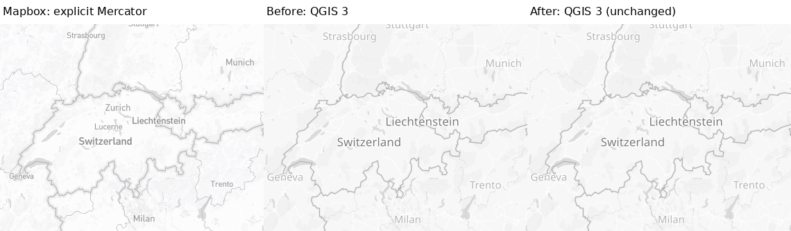
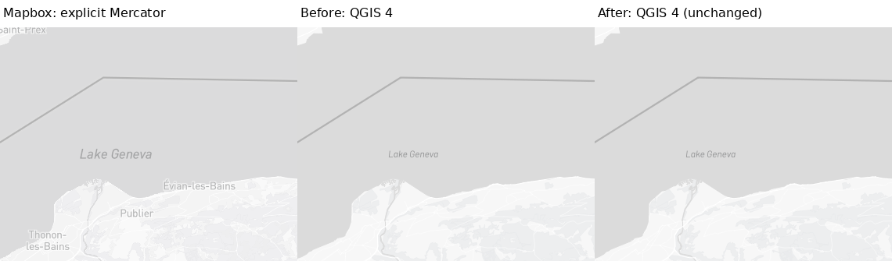
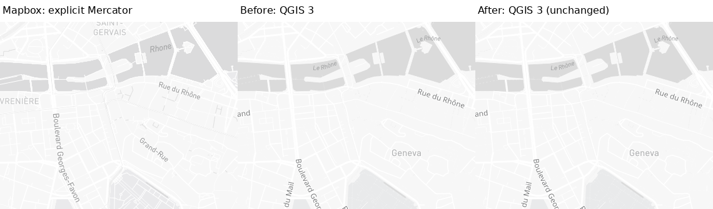
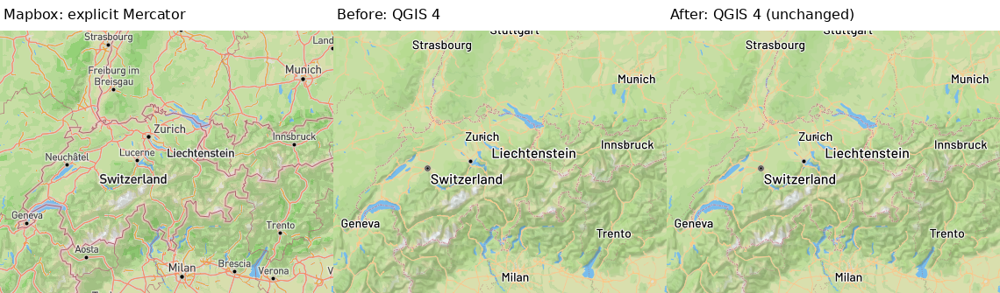
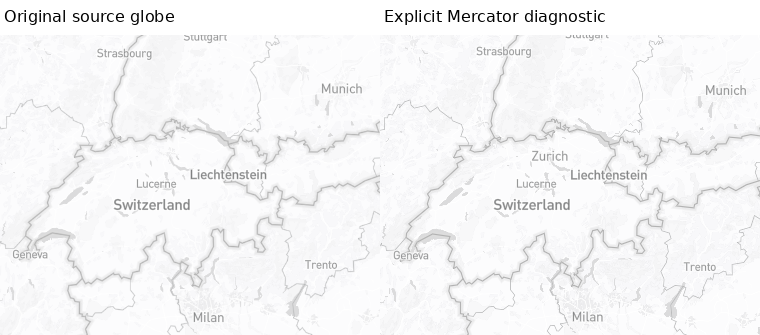
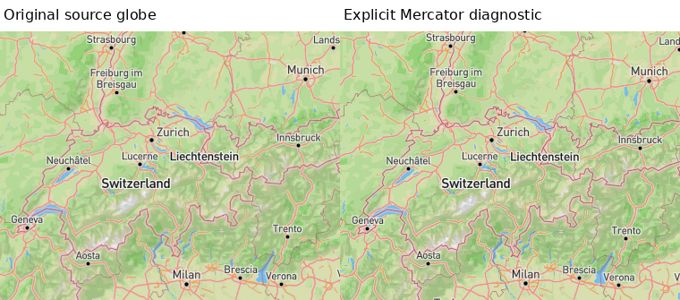

# Browser projection context — C01 (#1462)

Captured 2026-09-14 in the same active protected Gateway run. Baseline `1418e8ec1497c0865453a64a9eca0ae59a07fe53`;
implementation `d95175b8917c66aefe97cf463c904091bae3540a`. Map data © OpenStreetMap contributors; reference cartography © Mapbox.

This is a **measurement/diagnostic harness change only**. Default browser and production
QGIS maps do not change. The new explicit Mercator option is not a replacement for source
intent, a production globe implementation or acceptance of a product limitation.

## Results and independent dimensions

- **Semantics:** Source JSON/fingerprints, preprocessing, native fonts/labels and renderer
  remain unchanged. Both fresh source snapshots declare globe. Metadata records actual
  `getProjection()`, camera, canvas/DPR, browser/Mapbox versions and load state. Error
  payloads/URLs are not serialized. Executable Node regressions reject failed/unloaded
  maps before PNG and write metadata only after successful screenshot creation.
- **Usability:** Full maps and unscaled crops are retained below. Measurement does not
  certify class completeness, label legibility, topology, accessibility or output context.
- **Fidelity:**14/14 default browser Before/After/Repeat images are byte-identical;
  14/14 Mercator repeat pairs are byte-identical. Only the two overview references change
  between source globe and explicit Mercator. The other12 views are byte-identical even
  though Mapbox reports configured globe; its high-zoom transition is not a projection
  registration guarantee. Source and planar metrics are separately named in the manifest;
  neither is a cartographic pass or an improvement to unchanged native maps.
- **Operation:**28 camera/runtime cells (both complete seven-camera presets, QGIS3/Qt5
  and4/Qt6), each with Before/Repeat/After. All84 native PNG, full label inventories,
  runtime context and preprocessed-style sets are byte-identical within their cells.
  Both complete Docker test scripts pass211/82. Browser load flags/errors and nonblank
  image content checked for all70 browser captures. These are headless PNG paths only.

C01 remains OPEN: native DPI/style zoom, archived upstream tile data, geographic-registration
scope beyond recorded diagnostics and desktop/PDF/output fixtures are not closed. Source
projection is preserved by default for Light, Outdoors and custom snapshots; explicit mode
only changes the browser constructor. No runtime, font, raster or activity code is changed.
Other C01–C30 coverage cells retain their repository ledger status.

## Representative Mapbox reference | QGIS Before | QGIS After

The reference panel is explicitly requested **Mercator**. QGIS Before and After are
byte-identical. This proves harness isolation, not a visible renderer improvement.

### QGIS3 — switzerland-alps-z5-light

[Full-map comparison](qgis3-switzerland-alps-z5-light-full.png) · [Original source reference](switzerland-alps-z5-light-after-reference.png) · [Explicit planar reference](switzerland-alps-z5-light-mercator-reference.png)

### QGIS4 — lausanne-lavaux-z10-light

[Full-map comparison](qgis4-lausanne-lavaux-z10-light-full.png) · [Original source reference](lausanne-lavaux-z10-light-after-reference.png) · [Explicit planar reference](lausanne-lavaux-z10-light-mercator-reference.png)

### QGIS3 — geneva-urban-z14-light

[Full-map comparison](qgis3-geneva-urban-z14-light-full.png) · [Original source reference](geneva-urban-z14-light-after-reference.png) · [Explicit planar reference](geneva-urban-z14-light-mercator-reference.png)

### QGIS4 — switzerland-alps-z5-outdoors

[Full-map comparison](qgis4-switzerland-alps-z5-outdoors-full.png) · [Original source reference](switzerland-alps-z5-outdoors-after-reference.png) · [Explicit planar reference](switzerland-alps-z5-outdoors-mercator-reference.png)

## Original source reference remains separate

## Full matrix

| Camera | Original source | Explicit planar | QGIS3 Before / After | QGIS4 Before / After |
|---|---|---|---|---|
| switzerland-alps-z5-outdoors | [source](switzerland-alps-z5-outdoors-after-reference.png) | [planar](switzerland-alps-z5-outdoors-mercator-reference.png) | [Before](qgis3-switzerland-alps-z5-outdoors-before.png) / [After](qgis3-switzerland-alps-z5-outdoors-after.png) | [Before](qgis4-switzerland-alps-z5-outdoors-before.png) / [After](qgis4-switzerland-alps-z5-outdoors-after.png) |
| valais-geneva-outdoors | [source](valais-geneva-outdoors-after-reference.png) | [planar](valais-geneva-outdoors-mercator-reference.png) | [Before](qgis3-valais-geneva-outdoors-before.png) / [After](qgis3-valais-geneva-outdoors-after.png) | [Before](qgis4-valais-geneva-outdoors-before.png) / [After](qgis4-valais-geneva-outdoors-after.png) |
| lausanne-lavaux-z10-outdoors | [source](lausanne-lavaux-z10-outdoors-after-reference.png) | [planar](lausanne-lavaux-z10-outdoors-mercator-reference.png) | [Before](qgis3-lausanne-lavaux-z10-outdoors-before.png) / [After](qgis3-lausanne-lavaux-z10-outdoors-after.png) | [Before](qgis4-lausanne-lavaux-z10-outdoors-before.png) / [After](qgis4-lausanne-lavaux-z10-outdoors-after.png) |
| geneva-airport-motorway-z14-outdoors | [source](geneva-airport-motorway-z14-outdoors-after-reference.png) | [planar](geneva-airport-motorway-z14-outdoors-mercator-reference.png) | [Before](qgis3-geneva-airport-motorway-z14-outdoors-before.png) / [After](qgis3-geneva-airport-motorway-z14-outdoors-after.png) | [Before](qgis4-geneva-airport-motorway-z14-outdoors-before.png) / [After](qgis4-geneva-airport-motorway-z14-outdoors-after.png) |
| chamonix-trails-z14-outdoors | [source](chamonix-trails-z14-outdoors-after-reference.png) | [planar](chamonix-trails-z14-outdoors-mercator-reference.png) | [Before](qgis3-chamonix-trails-z14-outdoors-before.png) / [After](qgis3-chamonix-trails-z14-outdoors-after.png) | [Before](qgis4-chamonix-trails-z14-outdoors-before.png) / [After](qgis4-chamonix-trails-z14-outdoors-after.png) |
| zermatt-piste-z17-outdoors | [source](zermatt-piste-z17-outdoors-after-reference.png) | [planar](zermatt-piste-z17-outdoors-mercator-reference.png) | [Before](qgis3-zermatt-piste-z17-outdoors-before.png) / [After](qgis3-zermatt-piste-z17-outdoors-after.png) | [Before](qgis4-zermatt-piste-z17-outdoors-before.png) / [After](qgis4-zermatt-piste-z17-outdoors-after.png) |
| zermatt-trails-z18-outdoors | [source](zermatt-trails-z18-outdoors-after-reference.png) | [planar](zermatt-trails-z18-outdoors-mercator-reference.png) | [Before](qgis3-zermatt-trails-z18-outdoors-before.png) / [After](qgis3-zermatt-trails-z18-outdoors-after.png) | [Before](qgis4-zermatt-trails-z18-outdoors-before.png) / [After](qgis4-zermatt-trails-z18-outdoors-after.png) |
| switzerland-alps-z5-light | [source](switzerland-alps-z5-light-after-reference.png) | [planar](switzerland-alps-z5-light-mercator-reference.png) | [Before](qgis3-switzerland-alps-z5-light-before.png) / [After](qgis3-switzerland-alps-z5-light-after.png) | [Before](qgis4-switzerland-alps-z5-light-before.png) / [After](qgis4-switzerland-alps-z5-light-after.png) |
| zurich-region-z8-light | [source](zurich-region-z8-light-after-reference.png) | [planar](zurich-region-z8-light-mercator-reference.png) | [Before](qgis3-zurich-region-z8-light-before.png) / [After](qgis3-zurich-region-z8-light-after.png) | [Before](qgis4-zurich-region-z8-light-before.png) / [After](qgis4-zurich-region-z8-light-after.png) |
| lausanne-lavaux-z10-light | [source](lausanne-lavaux-z10-light-after-reference.png) | [planar](lausanne-lavaux-z10-light-mercator-reference.png) | [Before](qgis3-lausanne-lavaux-z10-light-before.png) / [After](qgis3-lausanne-lavaux-z10-light-after.png) | [Before](qgis4-lausanne-lavaux-z10-light-before.png) / [After](qgis4-lausanne-lavaux-z10-light-after.png) |
| bern-urban-z12-light | [source](bern-urban-z12-light-after-reference.png) | [planar](bern-urban-z12-light-mercator-reference.png) | [Before](qgis3-bern-urban-z12-light-before.png) / [After](qgis3-bern-urban-z12-light-after.png) | [Before](qgis4-bern-urban-z12-light-before.png) / [After](qgis4-bern-urban-z12-light-after.png) |
| geneva-urban-z14-light | [source](geneva-urban-z14-light-after-reference.png) | [planar](geneva-urban-z14-light-mercator-reference.png) | [Before](qgis3-geneva-urban-z14-light-before.png) / [After](qgis3-geneva-urban-z14-light-after.png) | [Before](qgis4-geneva-urban-z14-light-before.png) / [After](qgis4-geneva-urban-z14-light-after.png) |
| zurich-streets-z17-light | [source](zurich-streets-z17-light-after-reference.png) | [planar](zurich-streets-z17-light-mercator-reference.png) | [Before](qgis3-zurich-streets-z17-light-before.png) / [After](qgis3-zurich-streets-z17-light-after.png) | [Before](qgis4-zurich-streets-z17-light-before.png) / [After](qgis4-zurich-streets-z17-light-after.png) |
| geneva-streets-z18-light | [source](geneva-streets-z18-light-after-reference.png) | [planar](geneva-streets-z18-light-mercator-reference.png) | [Before](qgis3-geneva-streets-z18-light-before.png) / [After](qgis3-geneva-streets-z18-light-after.png) | [Before](qgis4-geneva-streets-z18-light-before.png) / [After](qgis4-geneva-streets-z18-light-after.png) |

[Manifest](manifest.json) records exact cameras, dimensions, native scale/DPI/CRS, source and preprocessing fingerprints, code hashes, source/planar metrics, repeated-control identity, actual requested/resolved label fonts and runtime snapshots. Upstream tile payloads are not archived. No historical PNG is called fresh.
