# Light logical-density and actual PDF-output audit — #1462

Fresh2026-09-14, baseline/current production `3ff79a9dbced1dd57cf9763963d5758b5a5a1af7`.
This is a **documentation-only validation slice**: the panels compare output modes,
not a Before/After implementation improvement. No production candidate is retained.
Map data ©OpenStreetMap contributors; reference cartography ©Mapbox.

## Findings and exact scope

- Two real extents (Bern requested12.25, Geneva14.25), QGIS3.44.11/Qt5 and4.2.0/Qt6,
  same fresh Light source and original globe projection. Separately requested Mercator
  references are byte-identical at these two cameras; five anchors per camera register
  within1e-6px. No overview/globe support or seven-preset sweep is inferred.
-24 initial PNGs:12 baseline/repeat cells (96DPI, DPR2, proportional192DPI).
  All repeats and complete label/source settings are identical. Four DPR2 pass-through
  renderer traces preserve PNG bytes. Eight supporting PNGs from PDF workers also match
  unwrapped96DPI controls. All36 PNG captures are nonblank, with real map content.
- `devicePixelRatio=2` at unchanged1280×900 logical size/96DPI generates2560×1800 device
  pixels without changing native tile zoom in either runtime. This is headless API
  coverage, **not a physical desktop screen or standalone PNG print-size pass**. Saved
  PNG metadata still reports96DPI; the transient QImage DPR is recorded separately.
- Same338.6667×238.125mm map extent/scale exported to actual one-map PDF pages using
  qfit's `AtlasExportTask._build_pdf_export_settings()`:150DPI, forceVectorOutput=true,
  rasterizeWholeImage=false; only DPI is varied for96/192 diagnostics. These are not
  full assembled atlas exports, packaged plugin installs, activities or map-context proof.
-48 PDFs:12 cells ×unwrapped/traced/control repeats. Original files and their fixed96DPI
  Poppler rasterizations are retained. Ten of12 cells (all QGIS3, plus QGIS4 at96/192DPI)
  have byte-identical raster output across all four PDFs. QGIS4's two150DPI cells vary by
  hundreds of low-amplitude pixels; raw PDFs also contain timestamps. Do not claim
  PDF-file identity, classify that variation as established noise, or mark C29 passed.
- QGIS4 actual vector-tile zoom changes with PDF density despite unchanged physical scale:
  Bern12.318207→12.923461→13.318207; Geneva14.318207→14.923461→15.318207 at96/150/192DPI.
  Rounded activation becomes12→13→13 and14→15→15. Actual unwrapped maps show new road,
  POI and building detail: Felsenauviadukt/Universität Bern and central Geneva are readable
  examples. This extends the OPEN/provisional-major C28 diagnosis to a real PDF path.
- QGIS3 stays at integer12/14; its150DPI continuous value differs by about0.000316 due
  render-context precision. Label placements still change across density (e.g. Bern
  Länggassstrasse/Geneva Boulevard Georges-Favon). Stable zoom is not label-output parity.
- PDF traces have a real `@map_scale` (60732.872199 and15183.218050); the parallel PNG
  scope still lacks it. Availability is output-path-specific, not a universal QGIS
  limitation. Four-image150DPI variation is disclosed; strict trace pixel-isolation is
  established in the96/192PDF and DPR2 PNG cells, not assumed for150DPI.

No style/filter/rank/width/font/projection/DPI workaround is shipped. DPR2 is rejected
as a substitute for print export: it does not preserve standalone PNG physical sizing
or establish PDF consistency. Source/native fractional eligibility, PDF density, label
placement, actual desktop/packaged-font/full atlas and other C01–C30 gaps remain OPEN.

## Matched output-mode details

### QGIS3 / bern-urban-z12-light / density

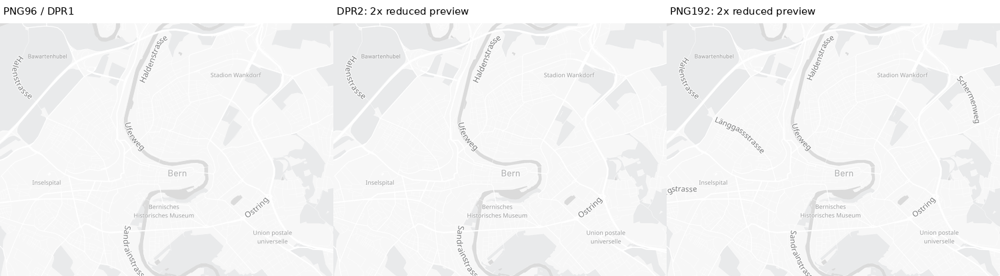

[Full-map panels](qgis3-bern-urban-z12-light-density-full.png). PDF views are rasterized at96DPI, not resized. DPR2/192DPI PNG previews alone are reduced2×; raw images are linked by the manifest.

### QGIS3 / bern-urban-z12-light / pdf

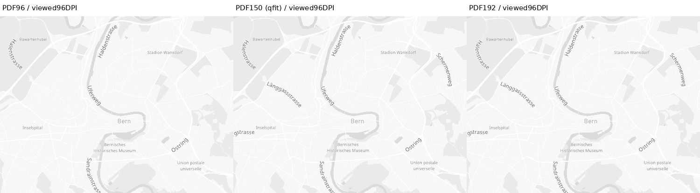

[Full-map panels](qgis3-bern-urban-z12-light-pdf-full.png). PDF views are rasterized at96DPI, not resized. DPR2/192DPI PNG previews alone are reduced2×; raw images are linked by the manifest.

### QGIS3 / bern-urban-z12-light / reference-pdf

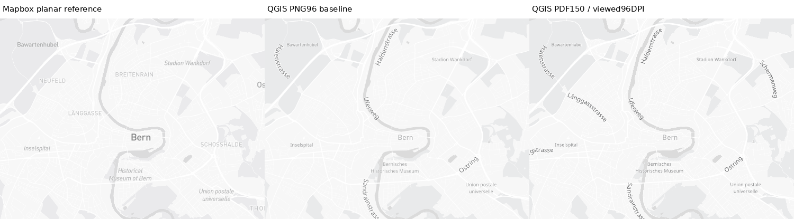

[Full-map panels](qgis3-bern-urban-z12-light-reference-pdf-full.png). PDF views are rasterized at96DPI, not resized. DPR2/192DPI PNG previews alone are reduced2×; raw images are linked by the manifest.

### QGIS3 / geneva-urban-z14-light / density

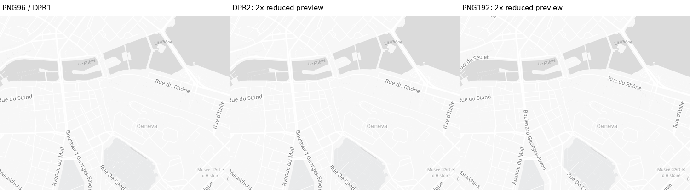

[Full-map panels](qgis3-geneva-urban-z14-light-density-full.png). PDF views are rasterized at96DPI, not resized. DPR2/192DPI PNG previews alone are reduced2×; raw images are linked by the manifest.

### QGIS3 / geneva-urban-z14-light / pdf

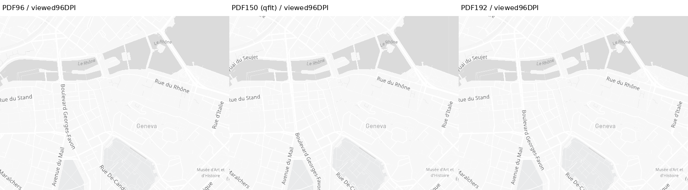

[Full-map panels](qgis3-geneva-urban-z14-light-pdf-full.png). PDF views are rasterized at96DPI, not resized. DPR2/192DPI PNG previews alone are reduced2×; raw images are linked by the manifest.

### QGIS3 / geneva-urban-z14-light / reference-pdf

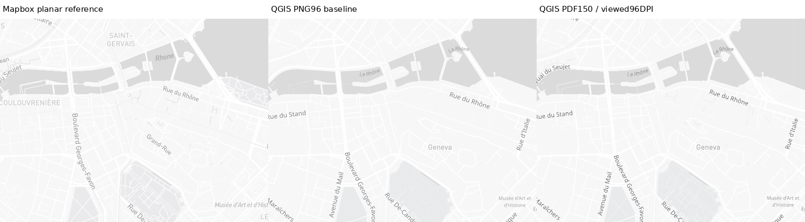

[Full-map panels](qgis3-geneva-urban-z14-light-reference-pdf-full.png). PDF views are rasterized at96DPI, not resized. DPR2/192DPI PNG previews alone are reduced2×; raw images are linked by the manifest.

### QGIS4 / bern-urban-z12-light / density

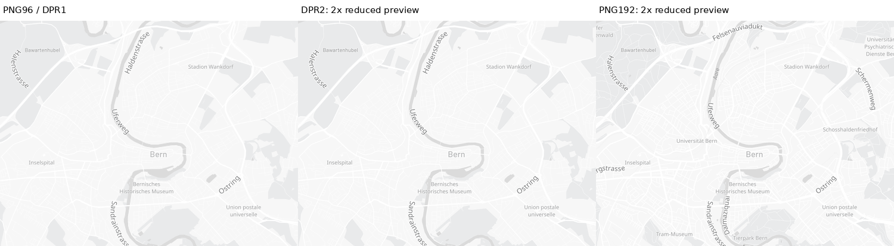

[Full-map panels](qgis4-bern-urban-z12-light-density-full.png). PDF views are rasterized at96DPI, not resized. DPR2/192DPI PNG previews alone are reduced2×; raw images are linked by the manifest.

### QGIS4 / bern-urban-z12-light / pdf

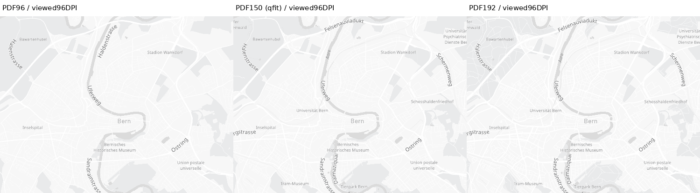

[Full-map panels](qgis4-bern-urban-z12-light-pdf-full.png). PDF views are rasterized at96DPI, not resized. DPR2/192DPI PNG previews alone are reduced2×; raw images are linked by the manifest.

### QGIS4 / bern-urban-z12-light / reference-pdf

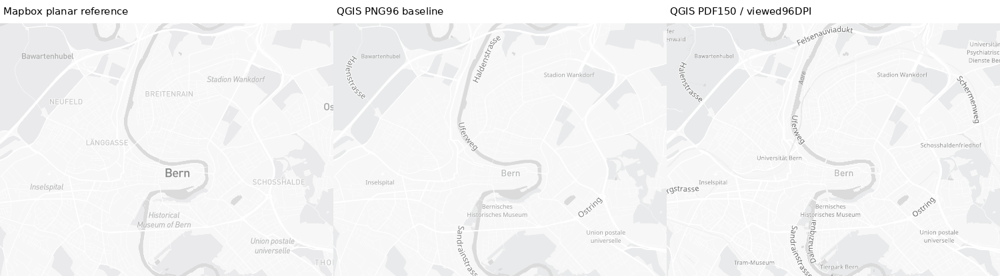

[Full-map panels](qgis4-bern-urban-z12-light-reference-pdf-full.png). PDF views are rasterized at96DPI, not resized. DPR2/192DPI PNG previews alone are reduced2×; raw images are linked by the manifest.

### QGIS4 / geneva-urban-z14-light / density

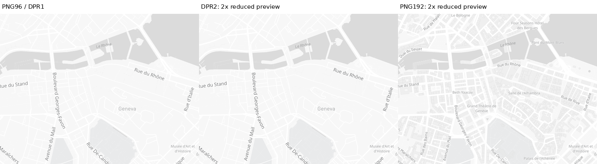

[Full-map panels](qgis4-geneva-urban-z14-light-density-full.png). PDF views are rasterized at96DPI, not resized. DPR2/192DPI PNG previews alone are reduced2×; raw images are linked by the manifest.

### QGIS4 / geneva-urban-z14-light / pdf

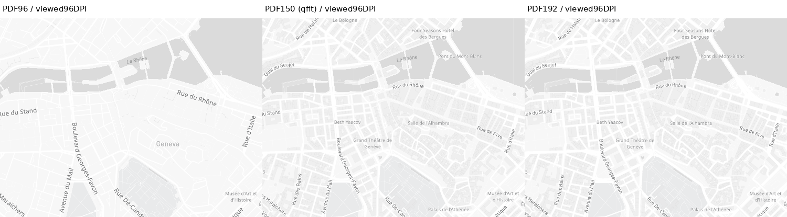

[Full-map panels](qgis4-geneva-urban-z14-light-pdf-full.png). PDF views are rasterized at96DPI, not resized. DPR2/192DPI PNG previews alone are reduced2×; raw images are linked by the manifest.

### QGIS4 / geneva-urban-z14-light / reference-pdf

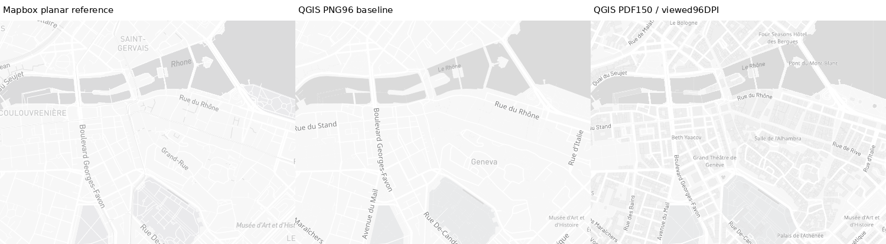

[Full-map panels](qgis4-geneva-urban-z14-light-reference-pdf-full.png). PDF views are rasterized at96DPI, not resized. DPR2/192DPI PNG previews alone are reduced2×; raw images are linked by the manifest.

## Reproduction and provenance

[Manifest](manifest.json) records every public artifact hash, unchanged runtime Python
hashes, source/settings/runtime snapshots, native expression traces and all pairwise
PDF variability. [Original Light source](light-v11.json), source-projection references
and explicit Mercator references are retained. Capture access was verified independently
inside each container; tokens, proxy credentials and machine-local paths are omitted.

Native setup uses the existing `render_qgis_vector` path and exact Light camera extent.
For DPR2 set `QgsMapSettings.setDevicePixelRatio(2)` without changing logical output size,
96DPI or extent. For physical192DPI use2×output size/192DPI and preserve original extent.
A one-page `QgsPrintLayout` and one `QgsLayoutItemMap` use the same layer/CRS/extent, map
size338.6667×238.125mm, `setKeepLayerSet(True)` and production PDF settings. Before each
export invalidate the item cache. Render/export complete while protected access is live.
The trace wraps each existing source-owned road width in a function which records
`@vector_tile_zoom`, `@zoom_level`, `coalesce(@map_scale,-1)` and returns the original
width unchanged. Unwrapped control PDFs independently establish the visible finding.
Rasterize every PDF with `pdftoppm -r 96 -singlefile -png` and compare decoded RGB pixels.
The PDF page is960×675points. View full files and native-size crops, not just metrics.

Fonts remain the existing openly licensed Docker installation, with actual resolved
faces in the complete label inventories; no ZIP font provisioning is added. No source
semantics/usability/reference-fidelity PASS follows from a density comparison alone.
