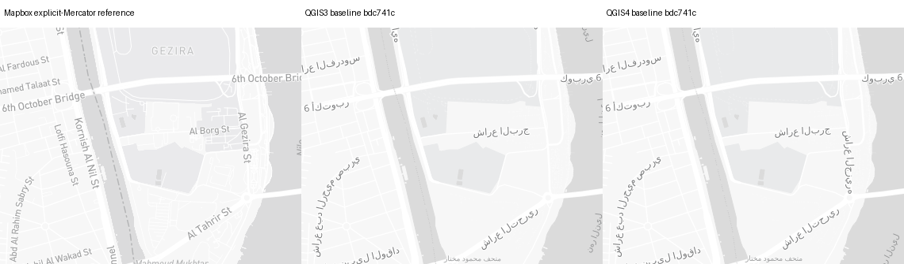
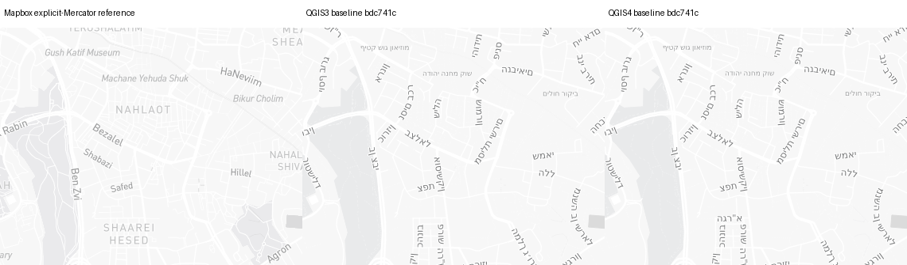
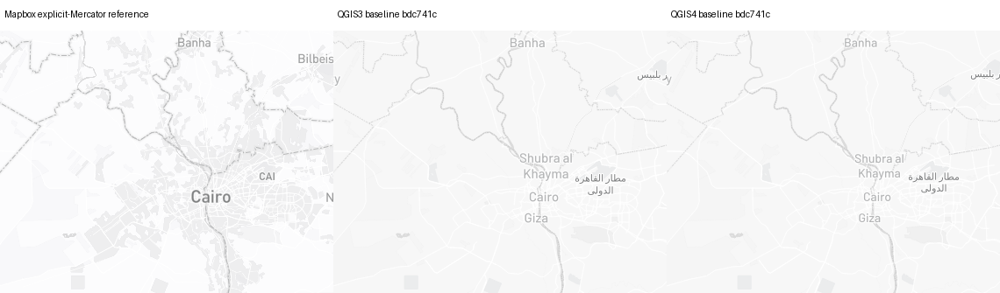

# Light label-role content audit — 2026-09-14

This is an **unchanged runtime baseline**, not a Before/After improvement.
Captured code: `bdc741cf38caf47e25cf1809055f506bb865efb9`.
Source SHA256: `87413e46c074e13aef420958a3ad101961766e6645336608e399ceccaffc6d32`.
Map data © OpenStreetMap contributors; reference cartography © Mapbox.

## Observations and independent verdicts

The [source](source.json) has 14 symbol owners: 13 English/local-name coalesces
and the airport's sizerank/ref/name expression. Both native builds produce the
same 39-rule content inventory. [QGIS3 audit](audit3/audit.json) and
[QGIS4 audit](audit4/audit.json) each evaluate 264 applicable text cases,
with 116 mismatches. These are synthetic **content evaluations**, not counts
of missing labels in the maps. Font bands repeat some cases.

- **PASS, scoped content:** country and major settlements (native coalesce),
  water-line and water-point labels (16 native English/local companion rules).
  The latter must be assessed together; a lone local arm is not a failure.
- **OPEN:** road, waterway, natural line/point, POI, subdivision, minor settlement,
  state, continent and airport owners. Native rules use local `name`, sometimes
  uppercased. Airport additionally loses its code/name branch. Existing feature
  gates and source/native zoom differences are separate, unresolved mechanisms.
- **Actual geographic corroboration:** Cairo and Jerusalem at z8 and z14,
  1280×900, EPSG:3857 in QGIS, source-globe and explicit-Mercator browser references
  preserved separately. Urban roads visibly use Arabic/Hebrew local names where
  source references use English/transliterated names. Cairo's observed airport
  feature has `sizerank: 15`, `ref: CAI`: source text is `CAI`, not its local name.
  Cairo, Giza and Jerusalem major settlement names retain the earlier repair.
- **Shaping/association remains unvalidated:** actual Arabic/Hebrew glyphs appear
  in these PNGs, but string survival and visual presence do not certify bidi,
  contextual joining, line direction, glyph fallback or collision behavior.
  No forced-local source variant, RTL-plugin diagnostic, long-name fixture,
  missing-font environment, desktop or PDF is claimed.

Native audit schema uses the actual text settings' requested columns. Missing
properties become NULL. The audit selects the appropriate English/local name arm
but deliberately does **not** claim source/native class, geometry, zoom or filter
eligibility. The repository's additional native regression checks all 16 water
companions together: 80 cases over five classes × two geometry populations ×
eight name scenarios, including actual predicate selection and exactly one
matching arm. It uses both filter and text requests, as native decoding does.

## Maps and native-size detail

Panels: **Mapbox explicit-Mercator reference | QGIS3 baseline | QGIS4 baseline**.
Crops are unscaled `(400,260,780,560)` (380×300 per panel); full panels preserve
1280×900. Whole maps and native-size details were inspected, not only metrics.

| Fixture | Full map | Detail | Original source projection |
| --- | --- | --- | --- |
| Cairo region z8 | [full](cairo-region-z8-full.png) | [crop](cairo-region-z8-crop.png) | [source](reference/cairo-region-z8/mapbox.png) |
| Cairo Nile z14 | [full](cairo-nile-z14-full.png) | [crop](cairo-nile-z14-crop.png) | [source](reference/cairo-nile-z14/mapbox.png) |
| Jerusalem region z8 | [full](jerusalem-region-z8-full.png) | [crop](jerusalem-region-z8-crop.png) | [source](reference/jerusalem-region-z8/mapbox.png) |
| Jerusalem city z14 | [full](jerusalem-city-z14-full.png) | [crop](jerusalem-city-z14-crop.png) | [source](reference/jerusalem-city-z14/mapbox.png) |





## Controls and provenance

- 16 browser PNGs (four cameras × two projection modes × repeat) and 16 native
  PNGs (four cameras × two QGIS generations × repeat). Every one of the eight
  browser and eight native PNG pairs is byte-identical. Native label snapshots
  and runtime contexts repeat exactly too; all four camera inventories match
  their runtime's offline native audit inventory. See [named pairs](repeat-controls.json).
- [40 actual browser/native geographic anchor comparisons](registration.json)
  are within 1e-6px in explicit Mercator mode. This is geographic registration,
  **not** source/native style-zoom or physical-DPI alignment. QGIS3 is at 100DPI;
  QGIS4 is at 96DPI. C01/C23/C28 remain open.
- Source features come from browser `queryRenderedFeatures`, grouped by source
  owner in each `mapbox.png.features.json`. They are not a native feature decoder
  trace. Live tile bytes were not archived. Network/map load flags and complete
  requested/resolved primary label font settings are included per capture.
- [Runtime files and exact native worker identity](generator-provenance.json),
  [summary](summary.json), [complete artifact hashes](manifest.json).
  No production, font, activity or package change is made by this slice.
- Two initial offline audits could not write their outputs because the container's
  default UID differed from the mounted directory owner. They are excluded.
  Explicit unprivileged UID1000:1000 recovered the audit; no capture, credentials,
  TLS or network policy was changed. All final offline audits ran network-disabled.

## Reproduce

Use a checkout named `qfit` at the captured commit, the source/evidence files,
Python/QGIS and the pinned font-enabled test images described by the repository.
Run the complete recorded content audit without network or credentials:

```sh
docker run --rm --network none --user "$(id -u):$(id -g)" \
  -v "$PWD/qfit:/work/qfit:ro" -v "$PWD/evidence:/evidence" \
  -e QT_QPA_PLATFORM=offscreen qfit/qgis:3.44.11-fonts \
  python3 /evidence/audit.py /work/qfit /evidence/source.json /evidence/replay-audit3
```

Use `qfit/qgis:4.2.0-fonts` and a new output directory for QGIS4. The native audit
contains assertions for the exact source text contracts and complete owner
mapping; it fails on unknown contracts rather than guessing an expected string.

The [portable live-capture worker](label_role_capture.py) takes explicit paths.
Use a **new writable evidence directory**, initially containing only a copy of
`source.json`. Install Playwright beside the checkout and use the repository's
authorized credential/proxy/CA route; OpenClaw users additionally follow their
same-run Gateway and container preflights. Never put tokens in arguments.

```sh
python3 label_role_capture.py --repo /path/to/qfit --evidence /path/to/new-evidence \
  --camera cairo-nile-z14 --mode browser --projection source --chromium /path/to/chromium
python3 label_role_capture.py --repo /path/to/qfit --evidence /path/to/new-evidence \
  --camera cairo-nile-z14 --mode browser --projection mercator --chromium /path/to/chromium
python3 label_role_capture.py --repo /path/to/qfit --evidence /path/to/new-evidence \
  --camera cairo-nile-z14 --mode native --qgis-major 3 --variant control
python3 label_role_capture.py --repo /path/to/qfit --evidence /path/to/new-evidence \
  --camera cairo-nile-z14 --mode native --qgis-major 3 --variant repeat
```

Native commands need the relevant QGIS/Qt/font runtime, not ordinary Python.
Repeat for all four named cameras and both native generations. The native worker
function is verbatim identical to the captured worker (SHA256 in provenance).
Browser replay uses the immutable source instead of fetching a new source and
accepts an explicit executable path; browser HTML, audit and screenshot hooks
are unchanged. Future live provider data can differ; do not promise PNG identity
across future tile revisions.

## Remaining work

C19 is OPEN: repair source-backed names with exact owner/derived-rule and field-
request guards; airport requires its distinct code/name contract. Preserve the
already-correct companion populations, current source filters, case transforms,
font bands and existing major/minor role-handoff diagnosis. Then validate actual
RTL/long-name behavior and screen/PDF/desktop paths separately. No renderer or
product limitation has been accepted; all other C01–C30 gaps remain required.
