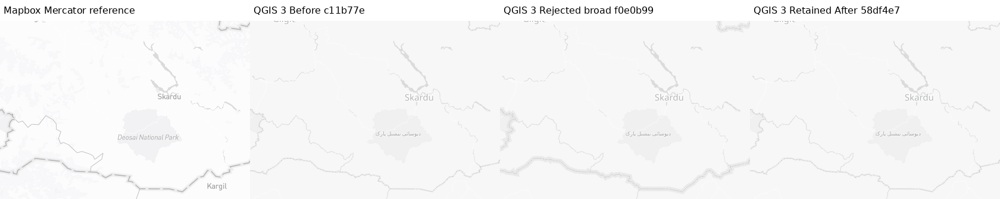
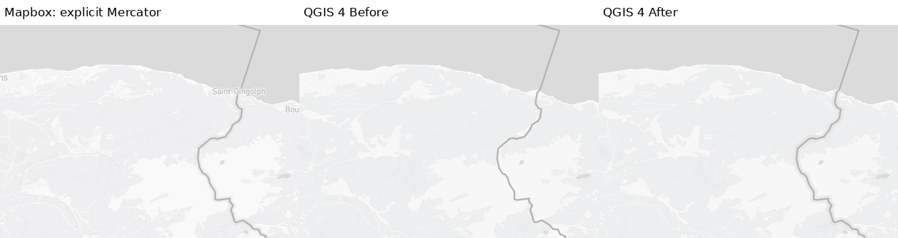
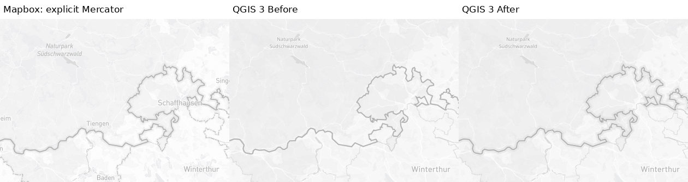
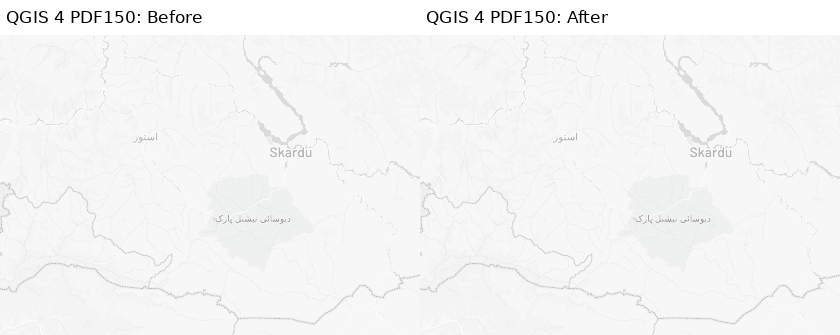

# Light ordinary national-boundary background — 2026-09-14

Scoped evidence for #1462; **C15 remains OPEN**. No limitation is accepted here.

## Decision and exact revisions

- Before: `c11b77ee2c5b6e99f807690d29f688721aa81f2e`.
- Rejected broad shared background: `f0e0b99fc0bd0346b7d0a89dec5eb43b3d81be67` (20 completed QGIS 3 maps in [inventory](broad-capture-inventory.json)). Its wider continuous halo dominates the still-thin disputed core. Interrupted frames are excluded.
- Narrowed paint: `93fcf486272a41922e84d4c7b2b166d77f5b70d3` (`production` folders).
- Guarded After: `58df4e72b88da58e9b3bab5d1fd34f219b7fd241` (`final` folders). All 48 maps, complete labels, native contexts and all boundary properties are byte-identical to the narrowed paint captures. Source/native-core guards were added without changing these outputs.
- Fresh source SHA-256: `87413e46c074e13aef420958a3ad101961766e6645336608e399ceccaffc6d32`. Five complete boundary source owners match the committed fixture. Live tile payloads are **not** archived/fingerprint-locked.

Only exact `mapbox/light-v11` / `admin-0-boundary-bg` / `disputed IS 'false'` is adapted. Width is source linear 5.2px at z3 to 10.4px at z12, clamped, converted once by 25.4/96. Opacity is source 0 at z3 to 0.5 at z4, clamped (QGIS property uses percent). The static fallback remains the actual native width/35% opacity for true, NULL, empty or other disputed status. Source/native ordinary-core and unique-owner checks must pass; existing native overrides are not overwritten. This is not a new worldview/status filter.

### Rejected broad versus retained status guard

All four panels use the same unscaled 420×300 crop `(450,180,870,480)`. Reference is explicit Mercator, not the source globe. Before and retained After are pixel-identical in this Kashmir disputed-detail crop at requested z6.9, z7 and z7.1 in both runtimes. Other ordinary segments in the full frames can change. Cyprus contains mixed ordinary/disputed segments: **no whole-crop or whole-map identity claim**.



[Full Kashmir Before](3/kashmir-z6.9/control/qgis.png) · [rejected broad](rejected-broad/3/kashmir-z6.9/qgis.png) · [retained After](3/kashmir-z6.9/final/qgis.png) · [Cyprus detail](qgis3-cyprus-z7-rejection-crop.png)

## Coverage and comparison discipline

242 native PNGs = 144 Before/repeat/initial-narrow + 48 guarded recaptures + 18 diagnostic probes + 20 rejected broad + 8 primary PDF-support + 4 public PDF-replay support. There are also 96 browser PNGs and 72 actual PDFs (48 primary + 24 replay). Derived crops/collages/PDF rasterizations are not additional captures. All 48 Before native repeat pairs and all 48 browser repeat pairs are byte-identical. No failed/blank/aborted frame is counted.

The first mutable-source 30-frame native matrix was invalidated in full, excluded and replaced using fixed baseline/candidate checkouts. One obsolete container-image reference failed preflight before rendering; retained image tags with verified identical RootFS layers resolved it. Fresh Gateway and per-container protected Mapbox preflight passed in this active run, with verified TLS and unchanged inherited protected environment. No credentials are stored here.

24 cameras: seven Light presets; Kashmir z6.9/7/7.1, Cyprus z7, Swiss admin1 z8 and US admin1 z7; opacity stops z2.9/3/3.1/3.9/4/4.1; Lausanne width stops z11.9/12/12.1; two synthetic activity overlays. Exact coordinates/zooms/dimensions are in [audit](audit.json). Derived camera descriptions retain template prose; use actual numeric fields and runtime extents, not that inherited prose. All images are 1280×900 at device ratio1. Native contexts record QGIS3.44.11/Qt5 and QGIS4/Qt6 versions, native EPSG:3857 extents, scale, output DPI100/96 and actual native vector/integer zooms. Browser contexts record GL version, source fingerprint, fonts and projections. Font policy is unchanged: Arial fallback, no font substitution experiment.

Source-projection references (`reference`, repeated in `reference-repeat`) remain separate from explicit-Mercator diagnostics (`reference-mercator`, repeated in `reference-mercator-repeat`). 240 actual browser/native anchor comparisons are within 1e-6 pixel in Mercator. **This does not resolve source/native style-zoom, density or source-globe mismatch.** Complete label snapshots and native contexts are unchanged by the candidate. Only the target background data-defined width/opacity changes in the recorded boundary paint. Native four-status expression/actual paint tests cover 14 zooms at96/192DPI (168 cases).

## Semantic repair is not universal fidelity improvement

All complete maps were visually inspected in navigation sheets, with native-size boundary crops and actual PDF outputs separately inspected. Larger source-intended ordinary-border backgrounds are retained; the broad disputed-background correction is rejected. The source's geographic status distinction is preserved. Visual comparison and aggregate fidelity remain independent of semantic paint correctness.

| Camera | QGIS3 planar MAE relative change | QGIS4 planar MAE relative change |
| --- | ---: | ---: |
| switzerland-alps-z5-light | +0.628007% | +0.261680% |
| zurich-region-z8-light | +0.560810% | +0.380376% |
| lausanne-lavaux-z10-light | -0.159515% | -0.204019% |

Positive means worse. The overview source-globe comparison also worsens (QGIS3 +1.68648%); it is separately reported, not averaged away or dismissed as noise. Lausanne improves modestly; overview/Zurich regress in this aggregate comparison. **Remaining blur/compositing/style-zoom fidelity is OPEN**, not an accepted limitation. Bern z12, Geneva z14, Zurich z17, Geneva z18 and the US admin1-only camera are byte-identical Before/After in both runtimes. Synthetic activities remain visible, not a real-route/accessibility certification.

### Representative native-size details

Each panel is an unscaled 420×300 crop, with **Mapbox explicit-Mercator reference | QGIS Before | QGIS After**. `audit.crop_boxes` records reproducible locations selected to show changed pixels; these are not representative-area statistics. Full files linked in the gallery retain native dimensions.



[Full Lausanne triptych](qgis4-lausanne-lavaux-z10-light-full.png) · [source-projection reference](reference/lausanne-lavaux-z10-light/mapbox.png)



[Full Zurich triptych](qgis3-zurich-region-z8-light-full.png) · [source-projection reference](reference/zurich-region-z8-light/mapbox.png)

## Actual PDFs and unresolved stability

[pdf-audit.json](pdf-audit.json) names all operands, SHA-256s, settings and36 comparisons for48 primary PDFs: Lausanne/Kashmir × QGIS3/4 × Before/After ×96/150/192DPI × repeat2. Fixed96DPI rasterizations permit matched viewing. Production settings are `forceVectorOutput=True`, `rasterizeWholeImage=False`, default150DPI; page338.6667×238.125mm and extents are locked. This executes the actual PDF exporter with production settings, **not a complete atlas task or desktop UI flow**. Eight supporting PNG/label/context/paint captures match the native matrix exactly.

20 of24 Before-or-After repeated PDF mode cells have identical rasterizations. The four QGIS4/150DPI modes vary: Lausanne Before423/After164 pixels; Kashmir Before189/After45 pixels. PDF file bytes are not claimed identical (metadata timestamps). Density-dependent detail remains unresolved. These extend—not close—the earlier Bern/Geneva PDF150 stability finding; no root cause/severity or harmlessness is inferred.

The published PDF generator was independently replayed: four native supporting frames/labels/contexts/paint match exactly; all24 PDF contexts match;20 predeclared stable raster cells reproduce exactly. QGIS4/150DPI initial-versus-replay initial differs by81 Lausanne/260 Kashmir pixels. Exact pairs are in [public-replay.json](public-replay.json).



[Before PDF](pdf/4/kashmir-z7/pdf-before/pdf150.pdf) · [After PDF](pdf/4/kashmir-z7/pdf-after/pdf150.pdf) · [full fixed-DPI viewing PNG](pdf/4/kashmir-z7/pdf-after/pdf150.png)

## Reproduction and integrity

Use a writable copy of this evidence directory; never overwrite immutable originals. Use separate checkouts named `qfit` at the Before and guarded After commits above, with their parents on the Python path. Use the matching Docker/QGIS/Qt/font environment ([RootFS fingerprints](image-rootfs.json)); preserve protected proxy/CA routing and run preflight through authorized Gateway execution before fresh captures. Do not copy tokens into commands/files/environment overrides or disable TLS. A failed preflight is a blocker for dependent captures, not a valid frame.

`background_capture.py` requires explicit `--repo`, `--evidence`, `--camera`, `--qgis-major` and `--variant`. Baseline variants: control/repeat/width-opacity/width-only/opacity-only. Candidate variants: production/final. `--mode browser --projection source|mercator` uses live source and refuses a changed snapshot. Delete only the selected output folders in the writable copy before replaying browser captures (existing files are skipped). The source snapshot and all233 runtime Python file hashes are verified for native captures. Candidate variant names refer to guarded runtime hashes; original93 initial paint has proven byte identity, not a separate public hash bypass.

```sh
python3 background_capture.py --repo /checkouts/before/qfit --evidence /evidence-copy --camera kashmir-z7 --qgis-major 3 --variant control
python3 background_capture.py --repo /checkouts/after/qfit --evidence /evidence-copy --camera kashmir-z7 --qgis-major 3 --variant final
python3 background_pdf_capture.py --repo /checkouts/after/qfit --evidence /evidence-copy --camera kashmir-z7 --qgis-major 3 --variant pdf-after
python3 pdf_pair_metrics.py --evidence /evidence-copy
```

Run native commands with the selected QGIS Python. `background_pdf_capture.py` requires adjacent `pdf_worker.py`; its embedded capture worker matches the original worker byte-for-byte ([provenance](generator-provenance.json)). Repeat in QGIS4. PDF viewing rasters use `pdftoppm -r 96 -singlefile -png INPUT.pdf OUTPUT_PREFIX`. The metric verifier recomputes every named primary pair, rather than choosing directory glob order. `manifest.json` hashes every published artifact except itself. The broad rejected source revision is preserved in branch history; diagnostic width-opacity reproduces its paint on the fixed baseline without changing production code.

## Remaining scope

No whole-criterion promotion: C15 OPEN, C12/C23 PARTIAL, C01/C28 OPEN, C29 PDF150 OPEN. Remaining work includes disputed/admin1/background blur and texture, source/native zoom and density, mixed fidelity, broader maritime/worldviews, topology/seams, multilingual/RTL typography, real sparse/dense/shared activities, accessibility, desktop/full-atlas/raster output and operational/performance coverage. No absent fixture is marked PASS. Outdoors/custom-style/raster/activities behavior is guarded by exact-style isolation and existing tests, not new broad visual certification.

Local guarded-code checks:2675 passed/189 skipped/299 subtests; complete Docker3 and4 each214 passed/82 skipped; both plugin packages built,9 package tests passed; stroke module147/147 statements covered. Native legacy focused paint:2 passed/256 subtests. CI/review status belongs to the implementation PR, not this pre-publication evidence snapshot.

## Complete camera gallery

| Camera | QGIS3 full / detail | QGIS4 full / detail | Source reference |
| --- | --- | --- | --- |
| switzerland-alps-z5-light | [full](qgis3-switzerland-alps-z5-light-full.png) / [detail](qgis3-switzerland-alps-z5-light-crop.png) | [full](qgis4-switzerland-alps-z5-light-full.png) / [detail](qgis4-switzerland-alps-z5-light-crop.png) | [source](reference/switzerland-alps-z5-light/mapbox.png) |
| zurich-region-z8-light | [full](qgis3-zurich-region-z8-light-full.png) / [detail](qgis3-zurich-region-z8-light-crop.png) | [full](qgis4-zurich-region-z8-light-full.png) / [detail](qgis4-zurich-region-z8-light-crop.png) | [source](reference/zurich-region-z8-light/mapbox.png) |
| lausanne-lavaux-z10-light | [full](qgis3-lausanne-lavaux-z10-light-full.png) / [detail](qgis3-lausanne-lavaux-z10-light-crop.png) | [full](qgis4-lausanne-lavaux-z10-light-full.png) / [detail](qgis4-lausanne-lavaux-z10-light-crop.png) | [source](reference/lausanne-lavaux-z10-light/mapbox.png) |
| bern-urban-z12-light | [full](qgis3-bern-urban-z12-light-full.png) / [detail](qgis3-bern-urban-z12-light-crop.png) | [full](qgis4-bern-urban-z12-light-full.png) / [detail](qgis4-bern-urban-z12-light-crop.png) | [source](reference/bern-urban-z12-light/mapbox.png) |
| geneva-urban-z14-light | [full](qgis3-geneva-urban-z14-light-full.png) / [detail](qgis3-geneva-urban-z14-light-crop.png) | [full](qgis4-geneva-urban-z14-light-full.png) / [detail](qgis4-geneva-urban-z14-light-crop.png) | [source](reference/geneva-urban-z14-light/mapbox.png) |
| zurich-streets-z17-light | [full](qgis3-zurich-streets-z17-light-full.png) / [detail](qgis3-zurich-streets-z17-light-crop.png) | [full](qgis4-zurich-streets-z17-light-full.png) / [detail](qgis4-zurich-streets-z17-light-crop.png) | [source](reference/zurich-streets-z17-light/mapbox.png) |
| geneva-streets-z18-light | [full](qgis3-geneva-streets-z18-light-full.png) / [detail](qgis3-geneva-streets-z18-light-crop.png) | [full](qgis4-geneva-streets-z18-light-full.png) / [detail](qgis4-geneva-streets-z18-light-crop.png) | [source](reference/geneva-streets-z18-light/mapbox.png) |
| kashmir-z6.9 | [full](qgis3-kashmir-z6.9-full.png) / [detail](qgis3-kashmir-z6.9-crop.png) | [full](qgis4-kashmir-z6.9-full.png) / [detail](qgis4-kashmir-z6.9-crop.png) | [source](reference/kashmir-z6.9/mapbox.png) |
| kashmir-z7 | [full](qgis3-kashmir-z7-full.png) / [detail](qgis3-kashmir-z7-crop.png) | [full](qgis4-kashmir-z7-full.png) / [detail](qgis4-kashmir-z7-crop.png) | [source](reference/kashmir-z7/mapbox.png) |
| kashmir-z7.1 | [full](qgis3-kashmir-z7.1-full.png) / [detail](qgis3-kashmir-z7.1-crop.png) | [full](qgis4-kashmir-z7.1-full.png) / [detail](qgis4-kashmir-z7.1-crop.png) | [source](reference/kashmir-z7.1/mapbox.png) |
| cyprus-z7 | [full](qgis3-cyprus-z7-full.png) / [detail](qgis3-cyprus-z7-crop.png) | [full](qgis4-cyprus-z7-full.png) / [detail](qgis4-cyprus-z7-crop.png) | [source](reference/cyprus-z7/mapbox.png) |
| swiss-admin1-z8 | [full](qgis3-swiss-admin1-z8-full.png) / [detail](qgis3-swiss-admin1-z8-crop.png) | [full](qgis4-swiss-admin1-z8-full.png) / [detail](qgis4-swiss-admin1-z8-crop.png) | [source](reference/swiss-admin1-z8/mapbox.png) |
| us-admin1-z7 | [full](qgis3-us-admin1-z7-full.png) / [detail](qgis3-us-admin1-z7-crop.png) | [full](qgis4-us-admin1-z7-full.png) / [detail](qgis4-us-admin1-z7-crop.png) | [source](reference/us-admin1-z7/mapbox.png) |
| overview-opacity-z2.9 | [full](qgis3-overview-opacity-z2.9-full.png) / [detail](qgis3-overview-opacity-z2.9-crop.png) | [full](qgis4-overview-opacity-z2.9-full.png) / [detail](qgis4-overview-opacity-z2.9-crop.png) | [source](reference/overview-opacity-z2.9/mapbox.png) |
| overview-opacity-z3 | [full](qgis3-overview-opacity-z3-full.png) / [detail](qgis3-overview-opacity-z3-crop.png) | [full](qgis4-overview-opacity-z3-full.png) / [detail](qgis4-overview-opacity-z3-crop.png) | [source](reference/overview-opacity-z3/mapbox.png) |
| overview-opacity-z3.1 | [full](qgis3-overview-opacity-z3.1-full.png) / [detail](qgis3-overview-opacity-z3.1-crop.png) | [full](qgis4-overview-opacity-z3.1-full.png) / [detail](qgis4-overview-opacity-z3.1-crop.png) | [source](reference/overview-opacity-z3.1/mapbox.png) |
| overview-opacity-z3.9 | [full](qgis3-overview-opacity-z3.9-full.png) / [detail](qgis3-overview-opacity-z3.9-crop.png) | [full](qgis4-overview-opacity-z3.9-full.png) / [detail](qgis4-overview-opacity-z3.9-crop.png) | [source](reference/overview-opacity-z3.9/mapbox.png) |
| overview-opacity-z4 | [full](qgis3-overview-opacity-z4-full.png) / [detail](qgis3-overview-opacity-z4-crop.png) | [full](qgis4-overview-opacity-z4-full.png) / [detail](qgis4-overview-opacity-z4-crop.png) | [source](reference/overview-opacity-z4/mapbox.png) |
| overview-opacity-z4.1 | [full](qgis3-overview-opacity-z4.1-full.png) / [detail](qgis3-overview-opacity-z4.1-crop.png) | [full](qgis4-overview-opacity-z4.1-full.png) / [detail](qgis4-overview-opacity-z4.1-crop.png) | [source](reference/overview-opacity-z4.1/mapbox.png) |
| lausanne-width-z11.9 | [full](qgis3-lausanne-width-z11.9-full.png) / [detail](qgis3-lausanne-width-z11.9-crop.png) | [full](qgis4-lausanne-width-z11.9-full.png) / [detail](qgis4-lausanne-width-z11.9-crop.png) | [source](reference/lausanne-width-z11.9/mapbox.png) |
| lausanne-width-z12 | [full](qgis3-lausanne-width-z12-full.png) / [detail](qgis3-lausanne-width-z12-crop.png) | [full](qgis4-lausanne-width-z12-full.png) / [detail](qgis4-lausanne-width-z12-crop.png) | [source](reference/lausanne-width-z12/mapbox.png) |
| lausanne-width-z12.1 | [full](qgis3-lausanne-width-z12.1-full.png) / [detail](qgis3-lausanne-width-z12.1-crop.png) | [full](qgis4-lausanne-width-z12.1-full.png) / [detail](qgis4-lausanne-width-z12.1-crop.png) | [source](reference/lausanne-width-z12.1/mapbox.png) |
| lausanne-lavaux-z10-light-activity | [full](qgis3-lausanne-lavaux-z10-light-activity-full.png) / [detail](qgis3-lausanne-lavaux-z10-light-activity-crop.png) | [full](qgis4-lausanne-lavaux-z10-light-activity-full.png) / [detail](qgis4-lausanne-lavaux-z10-light-activity-crop.png) | [source](reference/lausanne-lavaux-z10-light-activity/mapbox.png) |
| zurich-region-z8-light-activity | [full](qgis3-zurich-region-z8-light-activity-full.png) / [detail](qgis3-zurich-region-z8-light-activity-crop.png) | [full](qgis4-zurich-region-z8-light-activity-full.png) / [detail](qgis4-zurich-region-z8-light-activity-crop.png) | [source](reference/zurich-region-z8-light-activity/mapbox.png) |

Map images: © Mapbox, © OpenStreetMap contributors. This source-backed validation is not an assertion about sovereignty or political status.
