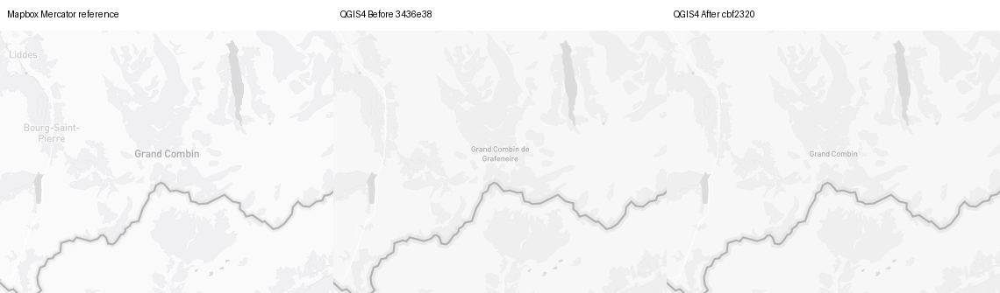
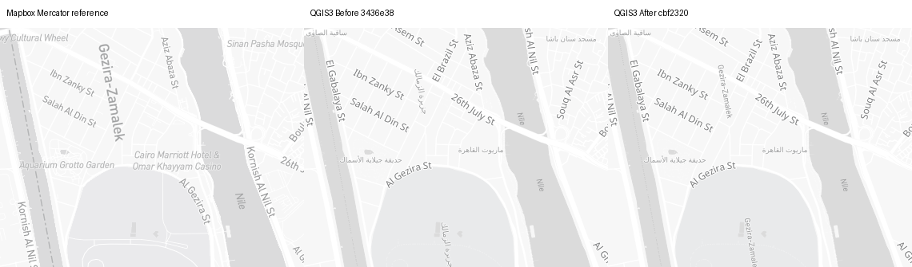
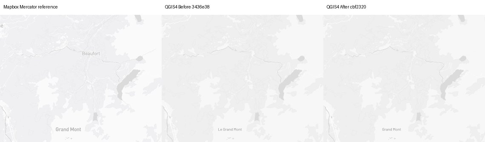

# Light natural-feature content — #1462

Fresh 2026-09-15 evidence, **not holistic completion**.
Before `3436e3833f9603db17be3f707afc43a86432f5d8`; captured After `cbf23209c8f7e935ffd1188ed90b88e38251c00d`.
[Provenance](provenance.json) · [Cameras](cameras.json) · [Source](source.json) ·
[Complete native audit](audit3-after/audit.json) · [Repeated controls](repeat-controls.json) ·
[Registration](registration.json) · [Metrics](metrics.json) · [Placement records](placement-audit.json).

## Retained scope and independent verdicts

- **C19 source content PASS (scoped):** only unique exact-Light natural-line/point
  symbol/natural_label owners with their original line-center/point placement,
  English/local coalesce and no transform. Change only unsplit native expression
  `"name"` before font bands. Request name_en/name explicitly; missing/NULL English
  falls back, empty English stays empty. Native overrides, ambiguous/changed owners,
  other roles, Outdoors and custom styles remain unchanged.
- **C02/C17–C22 contract preservation PASS (scoped):** all14source owners/39native
  rules audited. Exactly4native fields change per build (two owners × two font bands).
  [Preprocessing is byte-identical](processed-identity.json); class/worldview/rank,
  geometry, zoom, priority, placement, size and all font settings remain unchanged.
  Legacy real-QGIS regression covers16text +1296eligibility cases across the two
  unsplit rules; font-enabled Docker also exercises derived bands. Not glyph/bidi proof.
- Natural content audit20synthetic mismatches→0/build; other50unchanged.
  [Actual property replay QGIS3](natural-properties-qgis3.json) /
  [QGIS4](natural-properties-qgis4.json):39distinct camera/property sets, each through
  its own two native bands;18Before mismatches→0After, predicate disagreements0.
  Observed classes are landform/glacier. These are not unique features, native decode,
  source/native fetch/zoom parity or visible-label counts. Other source-present natural
  classes retain synthetic eligibility coverage, not invented geographic passes.
- **C19/C20 PNG observations PARTIAL:** Grand Combin de Grafeneire→Grand Combin,
  Le Grand Mont→Grand Mont, Basodino→Basòdino, Piccolo Corno Gries→Klein Grieshorn,
  Tour d'Aï→Tour d’Aï and Arabic island text→Gezira-Zamalek follow source properties.
  Ghiacciaio del Basòdino/Fieschergletscher local fallback remains. Centered Basòdino
  does change its accent; it is not a neutral no-English feature. Earlier edge-clipped
  Aletsch/Mont-Blanc labels are retained and supplemented, not passed as edge coverage.
- **C18/C20–C23 fidelity remains OPEN:** type is smaller than reference, Cairo has
  two native island occurrences versus one observed reference occurrence, and source
  line-center association differs from native wrapping/rotation. These are preserved
  limitations under investigation, not newly accepted ones. All non-natural text/provider
  populations are unchanged across28camera/runtime pairs; no general collision pass.
  Cairo Mercator MAE worsens+0.175452%/+0.174889% and Aletsch10+0.000826%/+0.000718%
  (QGIS3/4); four other changed views improve. No trade-off is dismissed as noise.
- **C01/C29 PNG PASS (scoped controls/registration):**112native PNGs,56Before/After
  repeat pairs match image/settings/context bytes and normalized placement records;
  56browser PNGs/28pairs match. All140actual Mercator/native anchors align within1e-6px.
  Six of seven standard Swiss views are Before/After byte-identical/build; Lausanne's
  punctuation changes. Native default DPI100/96 and source/native zoom remain unequal.
- **C28/C29 actual PDFs:**16production150DPI forced-vector PDFs in Cairo14 and
  Grand-Combin10, fixed338.667×238.125mm, viewed96DPI. Correct names are visible,
  but no general PDF legibility/association pass. All4QGIS3 raster repeats match;
  QGIS4 Cairo Before/After vary66/27pixels and Grand Combin261/271pixels.
  [Named pairs](pdf-audit.json). Contexts unchanged; variability unclassified.
  QGIS4 PDF detail/label density differs from PNG. No PDF-file identity, full-atlas,
  desktop or physical-density consistency claim.

## Matched maps and actual fonts

14views: seven Light presets; Aletsch8/10, Mont-Blanc10/12, Cairo14,
centered Basodino12 and Grand-Combin10. PNG1280×900 EPSG:3857;
QGIS3.44.11/Qt5.15.17 at100DPI and QGIS4.2.0/Qt6.9.2 at96DPI.
Both natural roles request and resolve Noto Sans Regular below8, Barlow Medium
from8 upward; all original rule bounds are preserved. Docker fonts are not
bundled/registered by the plugin ZIP. Source SHA256
`87413e46c074e13aef420958a3ad101961766e6645336608e399ceccaffc6d32` matches the
complete pinned source fixture. Live tile bytes are unarchived. Source globe
references stay under reference/; explicit planar diagnostics under reference-mercator/.
Eight PDF-hook PNGs and two portable-worker PNGs equal their ordinary native maps,
settings and contexts: [30named byte checks](supplemental-identity.json).

## Representative native-size detail

Panels: **Mapbox explicit-Mercator reference | QGIS Before | QGIS After**.
Unscaled380×300 crops plus35px captions; linked full maps keep1280×900 per panel.



Box(450,310,830,610): source-requested Grand Combin; native size remains smaller.
[Full map](grand-combin-z10-qgis4-full.png).



Box(270,30,650,330): correct island name, still smaller and repeated differently.
[Full map](cairo-nile-z14-qgis3-full.png).



Box(0,600,380,900): Grand Mont replaces Le Grand Mont near the lower map edge.
[Full map](mont-blanc-z10-qgis4-full.png).

[Centered Basòdino](basodino-z12-qgis3-crop.png) ·
[Actual Cairo PDF crop](cairo-nile-z14-qgis4-pdf150-crop.png) ·
[Actual Grand Combin PDF crop](grand-combin-z10-qgis4-pdf150-crop.png).
Map data © OpenStreetMap contributors; reference cartography © Mapbox.

## Complete gallery

Positive relative Mercator MAE movement is worse, not a semantic score.

| Camera | QGIS3 full / crop | QGIS4 full / crop | QGIS3 MAEΔ% | QGIS4 MAEΔ% |
| --- | --- | --- | ---: | ---: |
| switzerland-alps-z5-light | [full](switzerland-alps-z5-light-qgis3-full.png) / [crop](switzerland-alps-z5-light-qgis3-crop.png) | [full](switzerland-alps-z5-light-qgis4-full.png) / [crop](switzerland-alps-z5-light-qgis4-crop.png) | +0.000000 | +0.000000 |
| zurich-region-z8-light | [full](zurich-region-z8-light-qgis3-full.png) / [crop](zurich-region-z8-light-qgis3-crop.png) | [full](zurich-region-z8-light-qgis4-full.png) / [crop](zurich-region-z8-light-qgis4-crop.png) | +0.000000 | +0.000000 |
| lausanne-lavaux-z10-light | [full](lausanne-lavaux-z10-light-qgis3-full.png) / [crop](lausanne-lavaux-z10-light-qgis3-crop.png) | [full](lausanne-lavaux-z10-light-qgis4-full.png) / [crop](lausanne-lavaux-z10-light-qgis4-crop.png) | -0.006509 | -0.004036 |
| bern-urban-z12-light | [full](bern-urban-z12-light-qgis3-full.png) / [crop](bern-urban-z12-light-qgis3-crop.png) | [full](bern-urban-z12-light-qgis4-full.png) / [crop](bern-urban-z12-light-qgis4-crop.png) | +0.000000 | +0.000000 |
| geneva-urban-z14-light | [full](geneva-urban-z14-light-qgis3-full.png) / [crop](geneva-urban-z14-light-qgis3-crop.png) | [full](geneva-urban-z14-light-qgis4-full.png) / [crop](geneva-urban-z14-light-qgis4-crop.png) | +0.000000 | +0.000000 |
| zurich-streets-z17-light | [full](zurich-streets-z17-light-qgis3-full.png) / [crop](zurich-streets-z17-light-qgis3-crop.png) | [full](zurich-streets-z17-light-qgis4-full.png) / [crop](zurich-streets-z17-light-qgis4-crop.png) | +0.000000 | +0.000000 |
| geneva-streets-z18-light | [full](geneva-streets-z18-light-qgis3-full.png) / [crop](geneva-streets-z18-light-qgis3-crop.png) | [full](geneva-streets-z18-light-qgis4-full.png) / [crop](geneva-streets-z18-light-qgis4-crop.png) | +0.000000 | +0.000000 |
| aletsch-z10 | [full](aletsch-z10-qgis3-full.png) / [crop](aletsch-z10-qgis3-crop.png) | [full](aletsch-z10-qgis4-full.png) / [crop](aletsch-z10-qgis4-crop.png) | +0.000826 | +0.000718 |
| basodino-z12 | [full](basodino-z12-qgis3-full.png) / [crop](basodino-z12-qgis3-crop.png) | [full](basodino-z12-qgis4-full.png) / [crop](basodino-z12-qgis4-crop.png) | -0.032656 | -0.024366 |
| grand-combin-z10 | [full](grand-combin-z10-qgis3-full.png) / [crop](grand-combin-z10-qgis3-crop.png) | [full](grand-combin-z10-qgis4-full.png) / [crop](grand-combin-z10-qgis4-crop.png) | -0.450935 | -0.439136 |
| aletsch-z8 | [full](aletsch-z8-qgis3-full.png) / [crop](aletsch-z8-qgis3-crop.png) | [full](aletsch-z8-qgis4-full.png) / [crop](aletsch-z8-qgis4-crop.png) | +0.000000 | +0.000000 |
| mont-blanc-z12 | [full](mont-blanc-z12-qgis3-full.png) / [crop](mont-blanc-z12-qgis3-crop.png) | [full](mont-blanc-z12-qgis4-full.png) / [crop](mont-blanc-z12-qgis4-crop.png) | +0.000000 | +0.000000 |
| mont-blanc-z10 | [full](mont-blanc-z10-qgis3-full.png) / [crop](mont-blanc-z10-qgis3-crop.png) | [full](mont-blanc-z10-qgis4-full.png) / [crop](mont-blanc-z10-qgis4-crop.png) | -0.318735 | -0.311604 |
| cairo-nile-z14 | [full](cairo-nile-z14-qgis3-full.png) / [crop](cairo-nile-z14-qgis3-crop.png) | [full](cairo-nile-z14-qgis4-full.png) / [crop](cairo-nile-z14-qgis4-crop.png) | +0.175452 | +0.174889 |

## Reproduction and gates

Use a qfit checkout named qfit at the pinned baseline/candidate revision, Python,
PyQGIS and the matching open-font runtime. The hash files pin all233runtime Python
inputs. Credentials stay in the authorized inherited environment; no token argv.
Gateway-managed runs require their own same-run host/container preflights and must
stay alive until captures finish. Local image IDs are provenance, not public pull tags.

```bash
QT_QPA_PLATFORM=offscreen PYTHONHASHSEED=0 python3 natural_capture.py \
  --repo /checkout/qfit --evidence /evidence --mode native --qgis-major 3 \
  --camera grand-combin-z10 --variant after-replay-new
```

Use QGIS4 with `--qgis-major 4`; `--pdf` enables the archived actual
production-setting export hook. Browser mode uses --mode browser --projection
source|mercator and optional --chromium executable. Use a fresh evidence copy without
existing reference outputs for recapture; upstream tile changes can break byte identity.
Offline audit.py REPO SOURCE OUTPUT and natural_property_audit.py EVIDENCE 3 (or4)
require PyQGIS, not credentials/network. verify_evidence.py checks named controls and
regenerates only derived proofs/crops; pdf_audit.py uses Poppler at96DPI.
Manifest hashes every intended artifact except itself.

Local full2687passed/194skipped/368subtests; completeDocker3/4scripts219passed/82skipped
each with no argument overrides; legacy native1test/1312subtests; both ZIP builds
and9package tests; diff-check PASS. CI/reviews/final-head proof are recorded separately
when complete. No release/deployment or universal-output claim.

Five content owners remain: POI, subdivision, minor settlement, state, continent.
The full C01–C30 ledger remains8OPEN/16PARTIAL/5NOTASSESSED/1source-backedN/A.
Source/native zoom/handoff, road/boundary paint, rural/topology/seams, long/RTL shaping,
real activities/accessibility, packaged desktop, full atlas and map context remain required.
No absent cell or limitation is accepted; #1462 stays OPEN.
