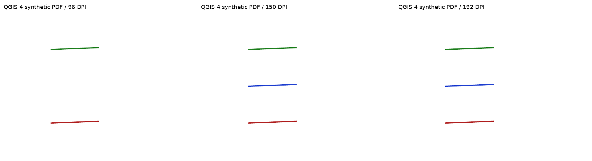
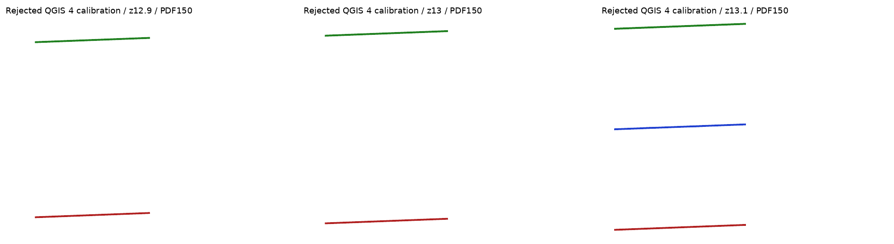

# Offline native vector-tile density reproduction — #1462

2026-09-14; source checkout baseline `75c6fdfad279d0eda11c5faad2c91e61753787c3`.
**Synthetic diagnostic, not real Light cartography or a production fix.** Every
capture runs with Docker `--network none`, no credential/proxy environment passed,
no qfit import, no source style, no fonts/labels and no live provider.

## Native density defect



PDF96 | PDF150 | PDF192, all rasterized at96DPI (640×480), not resized.
Red is always eligible, blue has native minimum zoom13, green has native
zoom-dependent width. The same archived MBTiles bytes feed both runtimes;
physical page169.3333×127mm, EPSG:3857, extent and scale60732.872199 are fixed.
The fixture uses three generated bent lines, not real roads or political features.

| Runtime | PNG and PDF native zoom at96 /150 /192DPI | Native integer activation |
| --- | --- | --- |
| QGIS3.44.11 / Qt5.15.17 |12.220213 /12.220213 /12.220213 |12 /12 /12 |
| QGIS4.2.0 / Qt6.9.2 |12.318207 /12.923653 /13.318207 |12 /13 /13 |

The blue feature appears only at QGIS4's higher densities. Thus qfit conversion,
Mapbox transport/data/fonts and browser camera registration are not necessary to
reproduce this **native rule-activation defect**. QGIS3's scoped zoom invariance
here does not supersede the real-map PDF label changes recorded by#1471.
`@map_scale` is absent in parallel PNG jobs (trace sentinel-1), present in PDF.

Baseline `3-final` and `4-final`:24 native PNGs and24 actual PDFs total;
plain/traced/repeated exports at each density. [72 exact named pairs](pair-audit.json)
all have identical RGB pixels, including pass-through trace isolation. PDF timestamps
mean PDF file bytes are not claimed identical. PDF96/150/192 cross-density differences
are not these repeat pairs. [QGIS3 reference modes](qgis3-pdf-modes.png).

## Rejected layer-local matrix calibration



Nominal camera12.9 |13 |13.1, PDF150 viewed at96DPI. This changes view scale and
is explicitly a transition triplet, not matched Before/After maps of a shipped fix.
The diagnostic changes only the fixture layer's matrix method to `Esri` and matrix
scale denominators by `96 ×0.00028 /0.0254 /2`, leaving tile geometry intact.
The96DPI physical-scale convention follows the tested baseline; it is not a new
accepted product scale policy. [Generator](calibration_probe.py).

- Native zoom becomes density-invariant in both runtimes over12.25/12.9/13/13.1
  and96/150/192DPI. This alone is insufficient for promotion.
- At nominal13, finite-precision extent/scale yields12.999999999999988; Esri's
  floor selects12 and hides the blue minzoom13 line. It returns at13.1. No epsilon
  adjustment has been validated. Native fractional interpolation still differs
  from logarithmic source zoom (12.25→12.318207). Do not treat either as solved.
- **Mutation is available:** although no `layer.setTileMatrixSet` exists,
  `layer.tileMatrixSet()` is mutable in both builds. The method change affects
  the layer. An inference that this returns an isolated copy was disproved.
- **Clone loses calibration:** native `layer.clone()` restores method0 (MapBox)
  and matrix12 scale136494.693366 instead of calibrated72223.963734. Project
  save/reload preserves method1 (Esri) and the calibrated scale. See [QGIS3 API
  probe](api3.json), [QGIS4 API probe](api4.json), and [executable probe](api_probe.py).
  This is native clone behavior, not a claim that qfit's atlas currently clones
  this layer. Full product lifecycle, other CRSs and legacy builds remain untested.

Calibrated `3-calibration`/`4-calibration`:96 native PNGs and96 PDFs total;
4 zooms ×3 densities ×2 runtimes ×plain/trace ×repeat per output type.
[288 exact named pairs](calibration-pairs.json) are pixel-identical within each
cell; blue visibility is verified in actual untraced and traced PNG/PDF images.
The simple matrix candidate is **rejected as-is**, not evidence that a robust
correction is impossible. No changes to qfit production code are retained.

## Replay without credentials or a qfit checkout

Use the repository's existing font-enabled images (exact build revisions in each
report) or a matching native PyQGIS environment. The render itself needs no fonts.
With this directory mounted as `/evidence`, a writable **new** output directory,
and network disabled:

```bash
docker run --rm --network none --user root -e QT_QPA_PLATFORM=offscreen \
  -v "$QFIT_EVIDENCE:/evidence" qfit/qgis:4.2.0-fonts \
  python3 /evidence/vector_tile_density_probe.py \
  --fixture-mbtiles /evidence/fixture.mbtiles --output-dir /evidence/replay4
```

Repeat with `qfit/qgis:3.44.11-fonts` and a new directory. `--fixture-mbtiles` reuses
identical published tile bytes. Omitting it generates synthetic tiles, whose hash
must be recorded before comparing runtimes. Do not substitute arbitrary MBTiles:
the probe's extent, feature roles and validity checks are for this fixture.
Use `calibration_probe.py` with the same two arguments for the rejected candidate.
`matrix_probe.py fixture.mbtiles` prints scalar transition samples.
`api_probe.py --fixture-mbtiles fixture.mbtiles --project probe.qgs` checks mutation,
clone and save/reload (project path must be writable; generated projects are local).

The generators fail on empty traces/failed exports and the PNG path rejects blank
content. An OPEN verdict is an observation, not an exit-status parity pass. Rendered
PDF content and all declared repeat pairs are verified separately by `audit.py` and
`audit_calibration.py`; these need Pillow, Poppler's `pdftoppm`, DejaVu Sans for panel
captions, and the recorded directory names. They assert persistent red/green and
observed blue visibility, not acceptance of the defect. Fontless QGIS rendering
must not be confused with the host caption-font dependency.

## Provenance, invalid attempts and scope

The manifest hashes every published artifact and exact generator. Source data are
synthetic and fully archived, unlike the earlier live-map evidence. No Mapbox
reference is applicable to this native control fixture. The prior real Light
captures remain historical evidence; this does not recapture or replace them.

An initial straight two-point fixture encoded degenerate one-point geometry and
was rejected by the blank-content check; only the bent-line final fixture is
published. Initial bootstrap/path/ownership problems were corrected before the
final matched runs. All final captures completed. Native reports identify the
actual QGIS revisions, not assumed image labels.

C01/C28 native-mechanism reproduction has scoped evidence. C28's product defect
remains OPEN; C02/C23 source-role/handoff, clone-safe boundary/scale handling,
labels, actual atlas/desktop, other CRSs and C29 real-PDF150 variation remain open.
Synthetic repeat stability does not explain the real-label repeat variation.
No accepted limitation, release, deployment or broad cartographic pass.

Exact upstream mechanism: [QGIS4 tile-matrix calculation](https://github.com/qgis/QGIS/blob/ec9a7f91d0f39a9b8393af4e37db86bb7e800140/src/core/qgstiles.cpp#L310)
normalizes scale by reference DPI/output DPI before selection; [native renderer](https://github.com/qgis/QGIS/blob/ec9a7f91d0f39a9b8393af4e37db86bb7e800140/src/core/vectortile/qgsvectortilelayerrenderer.cpp#L119)
uses it for fetched/rendered zoom and expression scope. Mutating label expressions
alone cannot coordinate all three paths.
