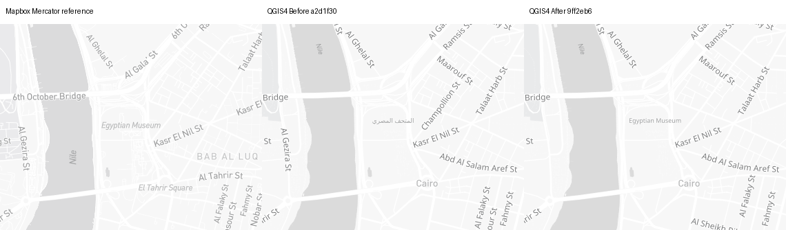
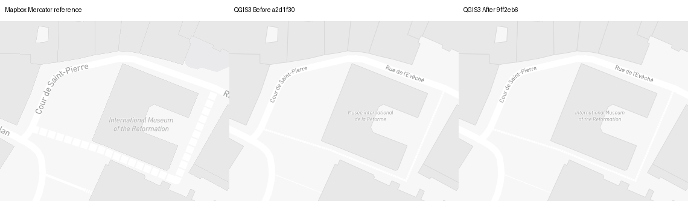
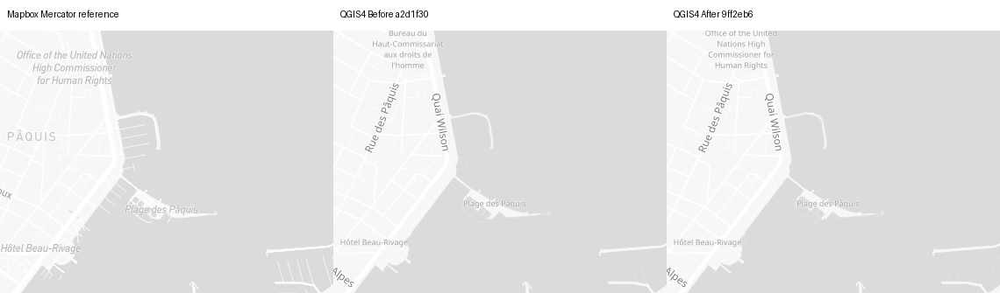

# Light POI source content — #1462

Fresh2026-09-15 evidence; **not holistic completion**.
Before`a2d1f30ed53a30ab752e86c5eb3d353669e068ab`; captured After`9ff2eb68092a0a762b19bf9fdc4462a5df6d4b80`.
[Provenance](provenance.json) · [Cameras](cameras.json) · [Source](source.json) ·
[Native audit QGIS3](audit3-after/audit.json) / [QGIS4](audit4-after/audit.json) ·
[Controls](repeat-controls.json) · [Settings changes](settings-changes.json) ·
[Registration](registration.json) · [Metrics](metrics.json) · [Placements](placement-audit.json).

## Scoped mechanism and independent verdicts

- **C19/C02 contract PASS (scoped):** unique exact-Light symbol/poi_label/point/
  no-transform/coalesce owner. The actual density generator resolves only its own bands;
  single clipped band retains original ID; source-owned ID collisions decline repair.
  Only native expression `"name"` becomes explicit `coalesce("name_en", "name")`.
  Missing/NULL English falls back, intentional empty English remains empty. Other
  styles/roles, changed owners, native overrides, rank/zoom/font/placement remain intact.
- All14source owners/39native rules audited: exactly3text fields change/build.
  POI15synthetic mismatches→0; other35unchanged. [Preprocessing](processed-identity.json)
  is byte-identical. Native bounds6–15/16/17+, rank thresholds1/2/3, fonts/size/priority
  and all other settings are preserved. Legacy/Docker regression covers24text+
  72rank/name-presence cases/build, not real glyph/bidi/long-name rendering.
- [Observed-property replay QGIS3](poi-properties-qgis3.json) /
  [QGIS4](poi-properties-qgis4.json):208distinct camera/property sets through3bands;
  138Before text mismatches→0After/build, predicate disagreements0. Each band's
  representative source zoom is explicit. These are not unique POIs, native
  decode/fetch/zoom parity or collision-survival counts.
- Actual names include Historical Museum of Bern, Voltaire Museum, Office of the
  United Nations High Commissioner for Human Rights, International Museum of the
  Reformation, Egyptian Museum, Flower clock, Riverside Café and Globus Geneva.
  Local-only names remain local. **C19 visible content PASS (scoped)** is not a
  whole multilingual, association or text-legibility certification.
- **C17/C18 OPEN:** source DIN Pro Italic; native 6–15 band resolves Noto Sans Regular,
  while 16/17+ resolve Barlow Italic. Source/native type size/wrapping differ visibly.
  This patch preserves rather than fixes the existing low-band font-role gap.
  Docker fonts are not bundled/registered by the plugin ZIP.
- **C21/C22 fidelity/collisions OPEN:** Cairo14 retains17native POI placements,
  but QGIS3 loses Champollion St, Adly St, Al Sheikh Rihan St and Al Azhr St;
  Al Azhr Bridge and Sirilanka St appear. QGIS4 loses Champollion St/Adly St,
  gains Sirilanka St. Both reduce Al Gezira St from two12-record occurrences to one.
  The other28camera/runtime non-POI text/provider populations are unchanged. Source-correct longer text changes collision outcomes; these changes
  are repeatable trade-offs, not noise or accepted limitations. Remaining C21 work
  must assess road/POI priority, font metrics and source/native selection together.
- **C23 OPEN:** static requested15.9/16/16.1 and16.9/17/17.1 triplets extend actual
  coverage. Native zoom rounds to16 already at15.9 and17 at16.9. Reference/native
  POI populations differ; [actual contexts and counts](transition-audit.json) keep
  the two pipelines distinct. No interactive, source/native zoom or data-fetch pass.
- **C01/C29 controls PASS (scoped):**120native PNGs/60repeat pairs match image,
  settings, context and normalized placements.60browser PNGs/30pairs match;
  150actual Mercator/native anchors align<1e-6px. Four Swiss preset Before/After
  views are identical per runtime. Full-map/crop visual inspection is separate
  from these numerical controls; no failed or blank capture is counted as valid.
- **C28/C29 actual PDFs:**16production150DPI forced-vector PDFs in Cairo14 and
  Geneva18,338.667×238.125mm, viewed96DPI. Correct museum names visible; native type
  remains small. Supporting PNGs/portable replay are named in
  [supplemental identity](supplemental-identity.json). PDF density/detail and Qt6
  raster-repeat variability remain open; no PDF-file identity, full atlas,
  desktop, actual activity/UI or accessibility claim.

## Candidate decision

Retain the source-content correction. Semantic content improves while measured
reference fidelity is mixed and collision/typography findings remain OPEN. No
rank, font or collision workaround is promoted; no alternative style candidate
was tested in this slice. No renderer limitation is accepted on Emman's behalf.

## Representative matched detail

Panels: **Mapbox explicit-Mercator reference | QGIS Before | QGIS After**.
Unscaled380×300 crops with35px captions; full panels retain1280×900 per map.



Box(450,310,830,610): source English museum name replaces Arabic-only content;
smaller nonitalic native type remains. [Full map](cairo-museum-z14-qgis4-full.png).



Box(900,570,1280,870): source English/local selection in the high density band;
Barlow Italic resolves but native type remains smaller. [Full map](geneva-streets-z18-light-qgis3-full.png).



Box(780,0,1160,300): source-requested long English name; existing wrapping,
font role and near-edge placement remain unresolved. [Full map](geneva-urban-z14-light-qgis4-full.png).

[Actual Cairo PDF crop](cairo-museum-z14-qgis4-pdf150-crop.png) ·
[Actual Geneva PDF crop](geneva-streets-z18-light-qgis4-pdf150-crop.png).
Map data © OpenStreetMap contributors; reference cartography © Mapbox.

## Complete gallery and trade-offs

Positive relative Mercator MAE movement is worse, not a semantic score.

| Camera | QGIS3 full / crop | QGIS4 full / crop | QGIS3 MAEΔ% | QGIS4 MAEΔ% |
| --- | --- | --- | ---: | ---: |
| switzerland-alps-z5-light | [full](switzerland-alps-z5-light-qgis3-full.png) / [crop](switzerland-alps-z5-light-qgis3-crop.png) | [full](switzerland-alps-z5-light-qgis4-full.png) / [crop](switzerland-alps-z5-light-qgis4-crop.png) | +0.000000 | +0.000000 |
| zurich-region-z8-light | [full](zurich-region-z8-light-qgis3-full.png) / [crop](zurich-region-z8-light-qgis3-crop.png) | [full](zurich-region-z8-light-qgis4-full.png) / [crop](zurich-region-z8-light-qgis4-crop.png) | +0.000000 | +0.000000 |
| lausanne-lavaux-z10-light | [full](lausanne-lavaux-z10-light-qgis3-full.png) / [crop](lausanne-lavaux-z10-light-qgis3-crop.png) | [full](lausanne-lavaux-z10-light-qgis4-full.png) / [crop](lausanne-lavaux-z10-light-qgis4-crop.png) | +0.000000 | +0.000000 |
| bern-urban-z12-light | [full](bern-urban-z12-light-qgis3-full.png) / [crop](bern-urban-z12-light-qgis3-crop.png) | [full](bern-urban-z12-light-qgis4-full.png) / [crop](bern-urban-z12-light-qgis4-crop.png) | -0.062937 | -0.063309 |
| geneva-urban-z14-light | [full](geneva-urban-z14-light-qgis3-full.png) / [crop](geneva-urban-z14-light-qgis3-crop.png) | [full](geneva-urban-z14-light-qgis4-full.png) / [crop](geneva-urban-z14-light-qgis4-crop.png) | +0.151576 | +0.179972 |
| zurich-streets-z17-light | [full](zurich-streets-z17-light-qgis3-full.png) / [crop](zurich-streets-z17-light-qgis3-crop.png) | [full](zurich-streets-z17-light-qgis4-full.png) / [crop](zurich-streets-z17-light-qgis4-crop.png) | +0.000000 | +0.000000 |
| geneva-streets-z18-light | [full](geneva-streets-z18-light-qgis3-full.png) / [crop](geneva-streets-z18-light-qgis3-crop.png) | [full](geneva-streets-z18-light-qgis4-full.png) / [crop](geneva-streets-z18-light-qgis4-crop.png) | +0.065820 | +0.054101 |
| cairo-museum-z14 | [full](cairo-museum-z14-qgis3-full.png) / [crop](cairo-museum-z14-qgis3-crop.png) | [full](cairo-museum-z14-qgis4-full.png) / [crop](cairo-museum-z14-qgis4-crop.png) | +0.316478 | +1.106202 |
| cairo-museum-z16 | [full](cairo-museum-z16-qgis3-full.png) / [crop](cairo-museum-z16-qgis3-crop.png) | [full](cairo-museum-z16-qgis4-full.png) / [crop](cairo-museum-z16-qgis4-crop.png) | +0.452360 | +0.341386 |
| geneva-poi-z15-9 | [full](geneva-poi-z15-9-qgis3-full.png) / [crop](geneva-poi-z15-9-qgis3-crop.png) | [full](geneva-poi-z15-9-qgis4-full.png) / [crop](geneva-poi-z15-9-qgis4-crop.png) | +0.030327 | +0.031477 |
| geneva-poi-z16 | [full](geneva-poi-z16-qgis3-full.png) / [crop](geneva-poi-z16-qgis3-crop.png) | [full](geneva-poi-z16-qgis4-full.png) / [crop](geneva-poi-z16-qgis4-crop.png) | -0.029762 | -0.032302 |
| geneva-poi-z16-1 | [full](geneva-poi-z16-1-qgis3-full.png) / [crop](geneva-poi-z16-1-qgis3-crop.png) | [full](geneva-poi-z16-1-qgis4-full.png) / [crop](geneva-poi-z16-1-qgis4-crop.png) | -0.037435 | -0.034049 |
| geneva-poi-z16-9 | [full](geneva-poi-z16-9-qgis3-full.png) / [crop](geneva-poi-z16-9-qgis3-crop.png) | [full](geneva-poi-z16-9-qgis4-full.png) / [crop](geneva-poi-z16-9-qgis4-crop.png) | +0.309776 | +0.301198 |
| geneva-poi-z17 | [full](geneva-poi-z17-qgis3-full.png) / [crop](geneva-poi-z17-qgis3-crop.png) | [full](geneva-poi-z17-qgis4-full.png) / [crop](geneva-poi-z17-qgis4-crop.png) | +0.247588 | +0.234724 |
| geneva-poi-z17-1 | [full](geneva-poi-z17-1-qgis3-full.png) / [crop](geneva-poi-z17-1-qgis3-crop.png) | [full](geneva-poi-z17-1-qgis4-full.png) / [crop](geneva-poi-z17-1-qgis4-crop.png) | +0.281126 | +0.272757 |

## Actual PDF repeats

[Named operands, fixed viewing DPI and contexts](pdf-audit.json); no PDF-file byte identity.

| Runtime | Camera | Variant | Raster changed pixels |
| --- | --- | --- | ---: |
| QGIS3 | cairo-museum-z14 | before-pdf | 0 |
| QGIS3 | cairo-museum-z14 | after-pdf | 0 |
| QGIS3 | geneva-streets-z18-light | before-pdf | 0 |
| QGIS3 | geneva-streets-z18-light | after-pdf | 0 |
| QGIS4 | cairo-museum-z14 | before-pdf | 83 |
| QGIS4 | cairo-museum-z14 | after-pdf | 56 |
| QGIS4 | geneva-streets-z18-light | before-pdf | 21 |
| QGIS4 | geneva-streets-z18-light | after-pdf | 25 |

[Final-head runtime identity](final-head-verification.json) · [Public byte reads](public-bytes-verification.json).

## Reproduction and gates

Use a checkout named qfit at the pinned revision, Python/PyQGIS and the matching
open-font Docker runtime.233runtime/package Python input hashes are asserted by
`poi_capture.py`. Gateway-managed captures require fresh same-run host/container
protected preflights and inherited credentials/proxy/CA; never token argv. Keep
that run alive until captures finish. Image IDs are provenance, not public pull tags.

```bash
QT_QPA_PLATFORM=offscreen PYTHONHASHSEED=0 python3 poi_capture.py \
  --repo /checkout/qfit --evidence /evidence --mode native --qgis-major 3 \
  --camera cairo-museum-z14 --variant after-replay-new
```

Use `--qgis-major 4` for Qt6; `--pdf` enables the actual production-setting export hook.
Browser mode uses `--mode browser`, `--projection source|mercator` and optional `--chromium`.
Use a fresh evidence copy without existing reference outputs for recapture; live
upstream tile changes can break identity. Offline `audit.py REPO SOURCE OUTPUT`
and `poi_property_audit.py EVIDENCE 3` (or4) need PyQGIS, not network. The verifier
regenerates only derived proofs/crops;`pdf_audit.py` rasterizes original PDFs at96DPI.
Manifest hashes every intended file except itself.

Full local2691passed/195skipped/383subtests; both completeDocker scripts220passed/
82skipped each, no argument overrides; legacy native1test/96subtests; bothZIPbuilds
and9package tests; diff-check PASS. Final-head CI/security/Sonar/Codex/Greptile
reviews and runtime identity are recorded separately after completion.

Four content owners remain: subdivision, minor settlement, state, continent.
Whole C01–C30 ledger remains8OPEN/16PARTIAL/5NOTASSESSED/1source-backedN/A.
Source/native zoom/handoff, road/boundary paint, rural/topology/seams, long/RTL
shaping, real activities/accessibility, packaged desktop, full atlas and map context
remain required. No absent fixture or limitation accepted; #1462 stays OPEN.
