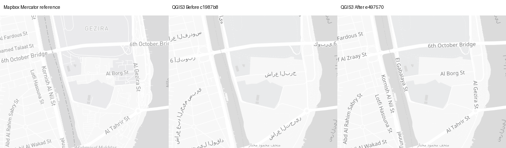
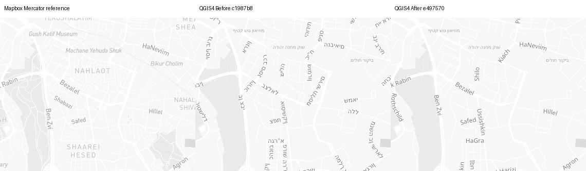
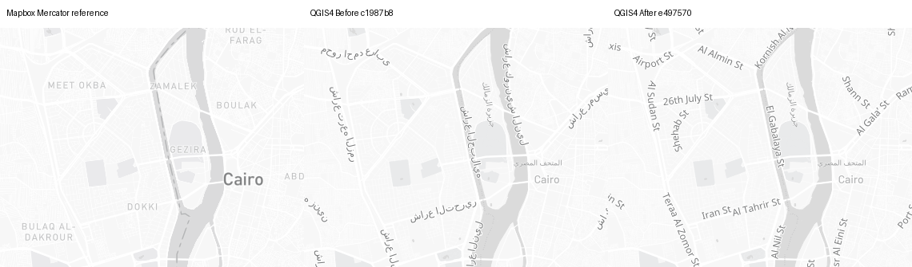
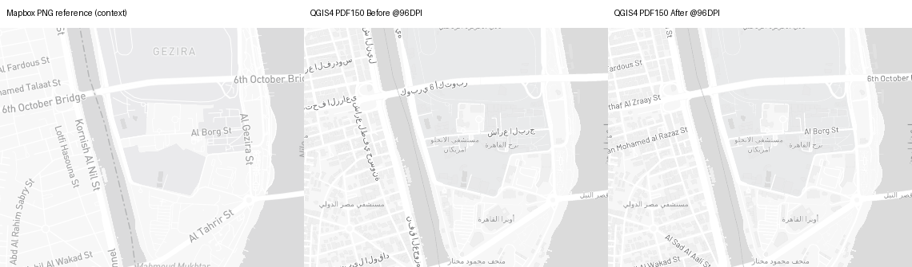

# Light road-name content — issue #1462

**Before:** `c1987b8134065e657b348fb9241d6c5dfbd8d96b`.
**After runtime:** `e49757024f54ed41de2418bfc3aa4a36628d3052`.
Fresh source SHA256: `87413e46c074e13aef420958a3ad101961766e6645336608e399ceccaffc6d32`.
All 14 source symbol owners match the repository fixture.

Map data © OpenStreetMap contributors; reference cartography © Mapbox.
No commercial fonts are redistributed. Font installation is Docker-scoped;
plugin ZIPs do not bundle or install desktop faces.

## Decision and scope

Retain exact-Light road English/local-name coalesce. Only the two audited native
road text expressions change. Source `has(name)` / seven-class eligibility,
zoom bounds, fonts, priority, placement and duplicate spacing are preserved.
Explicit field requests preserve missing/NULL versus empty English. Custom
styles, Outdoors, changed/duplicate source owners, transforms and native text
overrides stay untouched. The PR contains 198 native regression cases.

**Content passes; reference fidelity is mixed.** Cairo/Jerusalem now show the
source-requested names. At z14, Cairo's whole-image Mercator-reference MAE worsens
**10.2628% / 9.9736%** (QGIS 3/4); Jerusalem improves **1.8256% / 1.9282%**.
Cairo z12.1 worsens **24.9571% / 24.3768%**. All seven Swiss PNG views are
byte-identical Before/After. These are repeatable trade-offs, not noise.

Reader tasks inspected: identifying/following roads named by the source
(e.g. 6th October Bridge, Al Borg St, Al Tahrir St, HaNeviim, Betsalel), and
following synthetic activity tracks. Source names improve those tasks. Existing
native premature road activation below source z12, size/font, placement, density,
and physical-output differences remain OPEN. No universal usability or fidelity
pass is claimed, and no limitation is accepted.

Actual native **position records are not label counts**: curved labels can emit
many records with the same full text. Distinct road strings change from 87→123
and 88→126 in Cairo, and 229→143 and 231→146 in Jerusalem (QGIS 3/4).
This documents collision/density sensitivity, not unique-feature survival.
All non-road distinct-string populations stay identical; one duplicate natural
island label occurrence disappears in Cairo. Spatial association and broader
collision/density criteria remain open; unchanged settings do not imply
unchanged placement.

## Evidence index

- [Per-camera metrics](metrics.json): original-source and separate Mercator MAE,
  actual render context and changed pixels. Positive relative change is worse.
- [Named repeat controls](repeat-controls.json), [170 anchor comparisons](registration.json).
- [Generator provenance](generator-provenance.json): commits, 233 runtime source
  hashes, exact worker hash, image IDs, excluded attempts and scope.
- [Original source](source.json); complete content audits:
  [QGIS 3 Before](audit3-before/audit.json) / [After](audit3-after/audit.json),
  [QGIS 4 Before](audit4-before/audit.json) / [After](audit4-after/audit.json).
  Road's 10 synthetic content mismatches become zero; all other owners retain 106.
- Actual source-property replay: [QGIS 3](road-features-qgis3.json) /
  [QGIS 4](road-features-qgis4.json). 676 distinct camera/property cases per build,
  through two native bands and Before/After: 1,206 Before text mismatches become
  zero After; source/native property-predicate disagreements are zero. These are
  not unique roads, missing labels, native-decoder, zoom or collision counts.
- [PDF repeat pairs](pdf-audit.json): all four QGIS 3 pairs are raster-identical.
  QGIS 4 varies by 40/40 pixels in Cairo and 76/175 in Jerusalem (Before/After).
  C29 remains OPEN. The PDFs use production 150-DPI forced-vector settings,
  fixed 338.667×238.125 mm pages and EPSG:3857, viewed at 96 DPI. They retain the
  known C28 detail/activation difference, not a density-consistency fix.
- [Raw native PNG placement records](placed-label-audit.json) and
  [scoped interpretation](placed-label-summary.json). These accompany the PDF
  hooks, but are PNG results, not PDF text extraction or feature-ID equivalence.
- [Portable capture worker](road_name_capture.py), [actual PDF hook](pdf_worker.py),
  [content audit](audit.py), [feature replay](road_feature_audit.py),
  [PDF audit](pdf_audit.py), [artifact hashes](manifest.json).

## Comparability and capture validity

QGIS 3.44.11 / Qt 5.15.17 uses 100 DPI in PNG; QGIS 4.2.0 / Qt 6.9.2 uses
96 DPI. Each PNG is 1280×900, EPSG:3857, DPR1, with fixed source/camera per cell.
Original source-globe references remain separate from explicit-Mercator
references. All 34 native and 34 browser unchanged PNG pairs are byte-identical;
label inventories and context repeat too. Only the two road text fields differ
in all complete 39-rule inventories. All eight PDF-hook PNGs are byte-identical
to their corresponding ordinary PNGs. Registration is within 1e-6 px at all
170 actual Mercator/native anchors; this is not style-zoom or globe parity.

Live tile bytes remain unarchived. No full-atlas, desktop, forced-local RTL,
per-glyph font fallback, arbitrary-DPI or universal-repeatability pass is claimed.
Nine other content owners, airport code logic, major/minor role handoff,
topology/seams, real activities/UI, accessibility and map context remain required.

Fresh Gateway and every valid live-container preflight passed HTTP200/TLS with
unchanged inherited environment. Pre-build image IDs became unavailable after
gate builds, causing initial Docker125 failures before any native map. Offline
startup isolated that cause; rebuilt font images were tagged/pinned before
resuming. Failed attempts are excluded. No credential/egress/TLS fallback;
all capture processes finished within the same authorized run.

## Matched maps

Panels: **Mapbox explicit-Mercator reference | QGIS Before | QGIS After**.
Unscaled crops are 380×300 at `(400,260,780,560)`; full panels retain 1280×900
per map. PDF panels label the PNG reference as context only; Before/After are
actual 150-DPI PDFs rasterized at 96 DPI, not browser PDF output.

| Camera | Source reference | Mercator reference | QGIS3Before / After | QGIS4Before / After |
| --- | --- | --- | --- | --- |
| bern-urban-z12-light | [source](reference/bern-urban-z12-light/mapbox.png) | [planar](reference-mercator/bern-urban-z12-light/mapbox.png) | [Before](3/bern-urban-z12-light/control/qgis.png) / [After](3/bern-urban-z12-light/after/qgis.png) | [Before](4/bern-urban-z12-light/control/qgis.png) / [After](4/bern-urban-z12-light/after/qgis.png) |
| cairo-nile-z14 | [source](reference/cairo-nile-z14/mapbox.png) | [planar](reference-mercator/cairo-nile-z14/mapbox.png) | [Before](3/cairo-nile-z14/control/qgis.png) / [After](3/cairo-nile-z14/after/qgis.png) | [Before](4/cairo-nile-z14/control/qgis.png) / [After](4/cairo-nile-z14/after/qgis.png) |
| cairo-nile-z14-activity | [source](reference/cairo-nile-z14-activity/mapbox.png) | [planar](reference-mercator/cairo-nile-z14-activity/mapbox.png) | [Before](3/cairo-nile-z14-activity/control/qgis.png) / [After](3/cairo-nile-z14-activity/after/qgis.png) | [Before](4/cairo-nile-z14-activity/control/qgis.png) / [After](4/cairo-nile-z14-activity/after/qgis.png) |
| cairo-z11.9 | [source](reference/cairo-z11.9/mapbox.png) | [planar](reference-mercator/cairo-z11.9/mapbox.png) | [Before](3/cairo-z11.9/control/qgis.png) / [After](3/cairo-z11.9/after/qgis.png) | [Before](4/cairo-z11.9/control/qgis.png) / [After](4/cairo-z11.9/after/qgis.png) |
| cairo-z12 | [source](reference/cairo-z12/mapbox.png) | [planar](reference-mercator/cairo-z12/mapbox.png) | [Before](3/cairo-z12/control/qgis.png) / [After](3/cairo-z12/after/qgis.png) | [Before](4/cairo-z12/control/qgis.png) / [After](4/cairo-z12/after/qgis.png) |
| cairo-z12.1 | [source](reference/cairo-z12.1/mapbox.png) | [planar](reference-mercator/cairo-z12.1/mapbox.png) | [Before](3/cairo-z12.1/control/qgis.png) / [After](3/cairo-z12.1/after/qgis.png) | [Before](4/cairo-z12.1/control/qgis.png) / [After](4/cairo-z12.1/after/qgis.png) |
| cairo-z14.9 | [source](reference/cairo-z14.9/mapbox.png) | [planar](reference-mercator/cairo-z14.9/mapbox.png) | [Before](3/cairo-z14.9/control/qgis.png) / [After](3/cairo-z14.9/after/qgis.png) | [Before](4/cairo-z14.9/control/qgis.png) / [After](4/cairo-z14.9/after/qgis.png) |
| cairo-z15 | [source](reference/cairo-z15/mapbox.png) | [planar](reference-mercator/cairo-z15/mapbox.png) | [Before](3/cairo-z15/control/qgis.png) / [After](3/cairo-z15/after/qgis.png) | [Before](4/cairo-z15/control/qgis.png) / [After](4/cairo-z15/after/qgis.png) |
| cairo-z15.1 | [source](reference/cairo-z15.1/mapbox.png) | [planar](reference-mercator/cairo-z15.1/mapbox.png) | [Before](3/cairo-z15.1/control/qgis.png) / [After](3/cairo-z15.1/after/qgis.png) | [Before](4/cairo-z15.1/control/qgis.png) / [After](4/cairo-z15.1/after/qgis.png) |
| geneva-streets-z18-light | [source](reference/geneva-streets-z18-light/mapbox.png) | [planar](reference-mercator/geneva-streets-z18-light/mapbox.png) | [Before](3/geneva-streets-z18-light/control/qgis.png) / [After](3/geneva-streets-z18-light/after/qgis.png) | [Before](4/geneva-streets-z18-light/control/qgis.png) / [After](4/geneva-streets-z18-light/after/qgis.png) |
| geneva-urban-z14-light | [source](reference/geneva-urban-z14-light/mapbox.png) | [planar](reference-mercator/geneva-urban-z14-light/mapbox.png) | [Before](3/geneva-urban-z14-light/control/qgis.png) / [After](3/geneva-urban-z14-light/after/qgis.png) | [Before](4/geneva-urban-z14-light/control/qgis.png) / [After](4/geneva-urban-z14-light/after/qgis.png) |
| jerusalem-city-z14 | [source](reference/jerusalem-city-z14/mapbox.png) | [planar](reference-mercator/jerusalem-city-z14/mapbox.png) | [Before](3/jerusalem-city-z14/control/qgis.png) / [After](3/jerusalem-city-z14/after/qgis.png) | [Before](4/jerusalem-city-z14/control/qgis.png) / [After](4/jerusalem-city-z14/after/qgis.png) |
| jerusalem-city-z14-activity | [source](reference/jerusalem-city-z14-activity/mapbox.png) | [planar](reference-mercator/jerusalem-city-z14-activity/mapbox.png) | [Before](3/jerusalem-city-z14-activity/control/qgis.png) / [After](3/jerusalem-city-z14-activity/after/qgis.png) | [Before](4/jerusalem-city-z14-activity/control/qgis.png) / [After](4/jerusalem-city-z14-activity/after/qgis.png) |
| lausanne-lavaux-z10-light | [source](reference/lausanne-lavaux-z10-light/mapbox.png) | [planar](reference-mercator/lausanne-lavaux-z10-light/mapbox.png) | [Before](3/lausanne-lavaux-z10-light/control/qgis.png) / [After](3/lausanne-lavaux-z10-light/after/qgis.png) | [Before](4/lausanne-lavaux-z10-light/control/qgis.png) / [After](4/lausanne-lavaux-z10-light/after/qgis.png) |
| switzerland-alps-z5-light | [source](reference/switzerland-alps-z5-light/mapbox.png) | [planar](reference-mercator/switzerland-alps-z5-light/mapbox.png) | [Before](3/switzerland-alps-z5-light/control/qgis.png) / [After](3/switzerland-alps-z5-light/after/qgis.png) | [Before](4/switzerland-alps-z5-light/control/qgis.png) / [After](4/switzerland-alps-z5-light/after/qgis.png) |
| zurich-region-z8-light | [source](reference/zurich-region-z8-light/mapbox.png) | [planar](reference-mercator/zurich-region-z8-light/mapbox.png) | [Before](3/zurich-region-z8-light/control/qgis.png) / [After](3/zurich-region-z8-light/after/qgis.png) | [Before](4/zurich-region-z8-light/control/qgis.png) / [After](4/zurich-region-z8-light/after/qgis.png) |
| zurich-streets-z17-light | [source](reference/zurich-streets-z17-light/mapbox.png) | [planar](reference-mercator/zurich-streets-z17-light/mapbox.png) | [Before](3/zurich-streets-z17-light/control/qgis.png) / [After](3/zurich-streets-z17-light/after/qgis.png) | [Before](4/zurich-streets-z17-light/control/qgis.png) / [After](4/zurich-streets-z17-light/after/qgis.png) |

### Cairo roads: readable names, mixed fidelity



[QGIS3full](cairo-nile-z14-qgis3-full.png) / [QGIS4full](cairo-nile-z14-qgis4-full.png).
6th October Bridge, Al Borg St and Al Tahrir St now follow source content; network/size/
placement differences remain. Full-image error worsens despite this text repair.

### Jerusalem roads



[QGIS3full](jerusalem-city-z14-qgis3-full.png) / [QGIS4full](jerusalem-city-z14-qgis4-full.png).
HaNeviim, Betsalel, Ben Zvi and Hillel illustrate English/transliterated content.
Non-road POI/subdivision names remain local; this slice does not modify them.

### Pre-existing premature zoom activation, not a scale fix



At requested 11.9, native integer zoom12 activates road labels while source excludes
the owner. Before/After retains that defect; correct English cannot fix eligibility.
See complete context, boundary triplets and metric trade-offs.

### Actual one-map PDF



[CairoQGIS3BeforePDF](3/cairo-nile-z14/pdf-before/pdf150.pdf) /
[AfterPDF](3/cairo-nile-z14/pdf-after/pdf150.pdf);
[CairoQGIS4BeforePDF](4/cairo-nile-z14/pdf-before/pdf150.pdf) /
[AfterPDF](4/cairo-nile-z14/pdf-after/pdf150.pdf).
Jerusalem equivalents and repeats are in the corresponding camera folders.
No full atlas, desktop, universalrepeatability or physical-density consistency pass.

## Replay

Use the recorded Before or After checkout, the corresponding font-enabled QGIS
image, and authorized inherited credentials/proxy/CA. Follow repository harness
credential instructions and the active environment's preflight/lifecycle rules.
No OpenClaw-specific launcher or private path is required by these workers.
Run native workers in a writable copy of this evidence folder to avoid replacing
archived results. Keep liveclient access authorized until all workers finish.

```bash
python3 road_name_capture.py --repo /checkout/qfit --evidence /copy/evidence \
  --mode native --qgis-major 4 --camera cairo-nile-z14 --variant after
python3 road_name_capture.py --repo /checkout/qfit --evidence /copy/evidence \
  --mode native --qgis-major 4 --camera cairo-nile-z14 --variant pdf-after --pdf
python3 road_name_capture.py --repo /checkout/qfit --evidence /copy/evidence \
  --mode browser --camera cairo-nile-z14 --projection mercator
python3 audit.py /checkout/qfit /copy/evidence/source.json /copy/audit
python3 road_feature_audit.py /copy/evidence 4
```

The native PNG worker is verbatim from the actual capture. Browser replay uses the
archived source instead of a fresh fetch and accepts an explicit Chromium path.
PDF hook is the actual capturedimplementation. Offline content/property audits need
no credentials or network. Font installation is Docker-scoped; ZIPs do not bundle
or install desktop faces. These reproducible pieces do not imply immutable live tiles.
