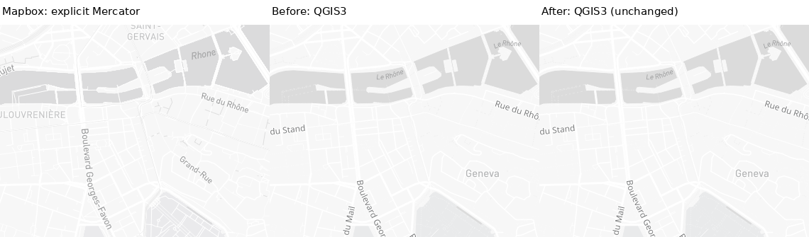
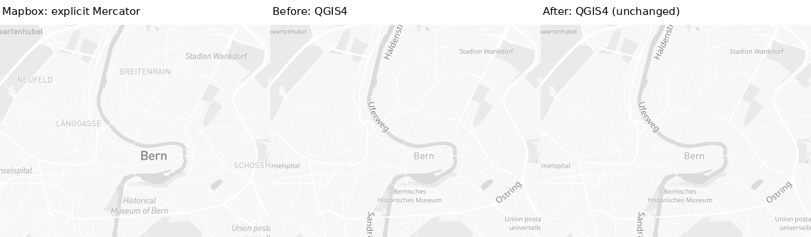
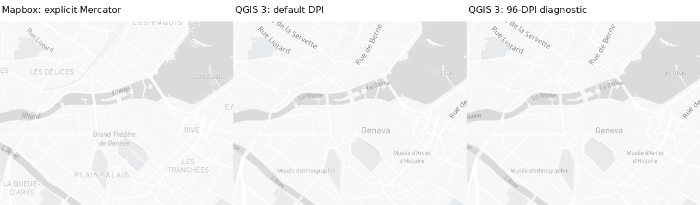
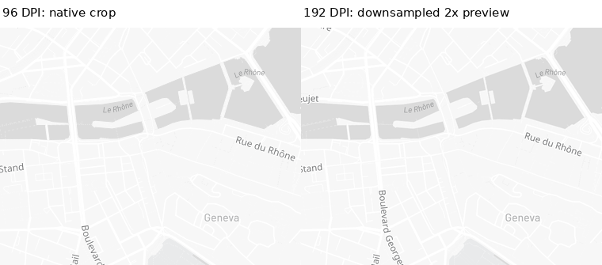
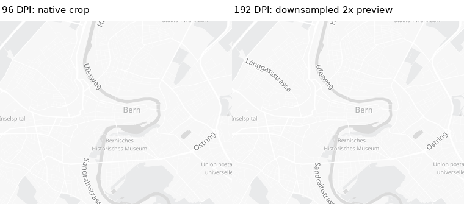
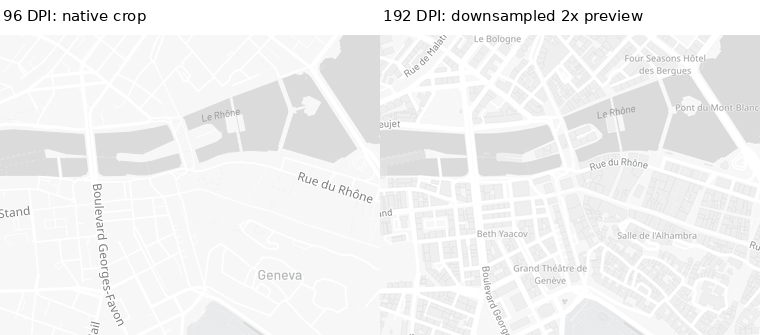
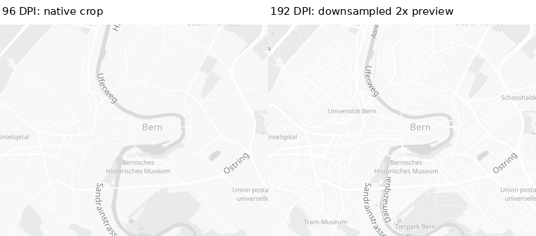

# Corrected Light renderer-scale metadata and density diagnosis — #1462

Fresh2026-09-14 evidence. Map data ©OpenStreetMap contributors; reference cartography ©Mapbox.
The retained change is **metadata-only plus numerical geometry regression**. Production
style/renderer/font/activity behavior and capture defaults remain unchanged. Original source
globe is preserved separately from explicit Mercator diagnostic references.

## Historical QGIS4 metadata correction

Old snapshots passed raw physical map scale directly to tile-matrix zoom methods. QGIS3's
Mapbox path does that; QGIS4 first normalizes by referenceDPI/outputDPI. Consequently the
old QGIS4 zoom fields were not actual renderer activation. The old PNGs and physical map
scale/extents remain valid; pre-correction metadata files are explicitly retained as such,
not silently rewritten. `renderer_zoom_valid:false` identifies those old QGIS4 rows here.

The corrected snapshot records separate `map_scale` and `tile_render_scale` and derives
continuous/render/fetch zoom from native `calculateTileScaleForMap()`. Native tests compare
against `scaleForRenderContext()` with a real painter. Eight pass-through road-width traces
record actual renderer variables while returning original widths; all eight PNGs equal
unwrapped controls byte-for-byte. The corrected metadata agrees with those actual variables.

## Independent dimensions and verdicts

- **Geometry PASS, scoped:**19cameras ×five actual browser anchors register to actual
  native Mercator extents/pixel transforms within1e-6px. All19 planar browser repeats and
  a separate original-globe overview repeat are byte-identical. Geometry reconstruction
  is within1e-8zoom. Do not change a registered extent to conceal style-zoom differences.
- **Metadata PASS, scoped:**38metadata-corrected camera/runtime captures preserve
  default PNGs, full label inventories and style JSON byte-for-byte. Four corrected-context
  density recaptures also preserve their PNG/labels/style. All38default and38DPI96 repeat
  pairs are byte-identical (152initial PNGs). Only metadata is corrected.
- **Source semantics/usability remain OPEN:**QGIS3 camera13 is native12.897638 at100DPI
  or12.941732 at96; QGIS4 is approximately13 in both cases. Atcamera13.1/96DPI, native
  values are13.025203 versus13.133934. Both interpolate linearly in scale rather than
  logarithmically in source camera zoom. DPI-only alignment is not retained as a fix;
  the registered Geneva13 crop still has a QGIS-only city label. Source filters/role
  handoff, integer activation, typography and other styles remain unchanged/unresolved.
- **Actual physical-density consistency OPEN:**Bern/Geneva each have96DPI1280×900
  versus192DPI2560×1800 outputs with identical extent and physical map scale. QGIS3 native
  zoom stays fixed. QGIS4 increases by1 (Bern12.318207→13.318207,
  Geneva14.318207→15.318207), changing detail and labels. This is confirmed by real maps,
  repeated controls and actual renderer-variable traces, not accepted as a limitation.
- **Expression scope OPEN:**the live headless job does not supply `@map_scale` in its
  expression scope (trace sentinel-1 denotes NULL). The logarithmic96DPI formula in the
  offline audit uses an explicitly constructed map-settings scope; sub3e-13 numerical
  error there is not proof of live availability or a deployable label correction. An
  initial trace wrapper propagated NULL and changed widths; it is invalid and excluded.

The native geometry regression has285cases/runtime (19cameras ×three viewport shapes
×five proportional pixel/DPI factors), also passing on nativeQGIS3.34.4. It validates
physical scale/extent/center, not renderer-zoom invariance. Portrait/small/density cases
in that test are numerical-only. The offline six-DPI decomposition adds114settings
cells/runtime, now separating raw-matrix values from actual runtime tile-render scale.

These are headless PNGs, not actual high-DPI screens, desktop/PDF or activity/UI output.
Downsampled density previews are labelled, never asserted pixel-identical. Live tile
payloads were not archived. C01–C30 gaps stay open as recorded in the repository ledger.

## Representative reference | Before | After (unchanged maps)

[Full comparison](qgis3-geneva-urban-z14-light-unchanged-full.png). Only renderer-context metadata changes.

[Full comparison](qgis4-bern-urban-z12-light-unchanged-full.png). Only renderer-context metadata changes.

## Rejected DPI-only calibration diagnostic

[Full maps](qgis3-geneva-z13-light-full.png). Third panel is an unshipped DPI probe, not the promoted After.

## Physical-density outputs — QGIS4 consistency OPEN

[Full96DPI](qgis3-geneva-urban-z14-light-dpi96-qgis.png) · [Full192DPI](qgis3-geneva-urban-z14-light-dpi192-qgis.png). Right preview is downsampled2×; inspect native files.

[Full96DPI](qgis3-bern-urban-z12-light-dpi96-qgis.png) · [Full192DPI](qgis3-bern-urban-z12-light-dpi192-qgis.png). Right preview is downsampled2×; inspect native files.

[Full96DPI](qgis4-geneva-urban-z14-light-dpi96-qgis.png) · [Full192DPI](qgis4-geneva-urban-z14-light-dpi192-qgis.png). Right preview is downsampled2×; inspect native files.

[Full96DPI](qgis4-bern-urban-z12-light-dpi96-qgis.png) · [Full192DPI](qgis4-bern-urban-z12-light-dpi192-qgis.png). Right preview is downsampled2×; inspect native files.

## Full matrix

| Camera | Explicit planar reference | QGIS3 Before /After | QGIS4 Before /After |
|---|---|---|---|
| switzerland-alps-z5-light | [reference](switzerland-alps-z5-light-reference.png) | [Before](qgis3-switzerland-alps-z5-light-before-qgis.png) / [After](qgis3-switzerland-alps-z5-light-after-qgis.png) | [Before](qgis4-switzerland-alps-z5-light-before-qgis.png) / [After](qgis4-switzerland-alps-z5-light-after-qgis.png) |
| zurich-region-z8-light | [reference](zurich-region-z8-light-reference.png) | [Before](qgis3-zurich-region-z8-light-before-qgis.png) / [After](qgis3-zurich-region-z8-light-after-qgis.png) | [Before](qgis4-zurich-region-z8-light-before-qgis.png) / [After](qgis4-zurich-region-z8-light-after-qgis.png) |
| lausanne-lavaux-z10-light | [reference](lausanne-lavaux-z10-light-reference.png) | [Before](qgis3-lausanne-lavaux-z10-light-before-qgis.png) / [After](qgis3-lausanne-lavaux-z10-light-after-qgis.png) | [Before](qgis4-lausanne-lavaux-z10-light-before-qgis.png) / [After](qgis4-lausanne-lavaux-z10-light-after-qgis.png) |
| bern-urban-z12-light | [reference](bern-urban-z12-light-reference.png) | [Before](qgis3-bern-urban-z12-light-before-qgis.png) / [After](qgis3-bern-urban-z12-light-after-qgis.png) | [Before](qgis4-bern-urban-z12-light-before-qgis.png) / [After](qgis4-bern-urban-z12-light-after-qgis.png) |
| geneva-urban-z14-light | [reference](geneva-urban-z14-light-reference.png) | [Before](qgis3-geneva-urban-z14-light-before-qgis.png) / [After](qgis3-geneva-urban-z14-light-after-qgis.png) | [Before](qgis4-geneva-urban-z14-light-before-qgis.png) / [After](qgis4-geneva-urban-z14-light-after-qgis.png) |
| zurich-streets-z17-light | [reference](zurich-streets-z17-light-reference.png) | [Before](qgis3-zurich-streets-z17-light-before-qgis.png) / [After](qgis3-zurich-streets-z17-light-after-qgis.png) | [Before](qgis4-zurich-streets-z17-light-before-qgis.png) / [After](qgis4-zurich-streets-z17-light-after-qgis.png) |
| geneva-streets-z18-light | [reference](geneva-streets-z18-light-reference.png) | [Before](qgis3-geneva-streets-z18-light-before-qgis.png) / [After](qgis3-geneva-streets-z18-light-after-qgis.png) | [Before](qgis4-geneva-streets-z18-light-before-qgis.png) / [After](qgis4-geneva-streets-z18-light-after-qgis.png) |
| geneva-z12.9-light | [reference](geneva-z12.9-light-reference.png) | [Before](qgis3-geneva-z12.9-light-before-qgis.png) / [After](qgis3-geneva-z12.9-light-after-qgis.png) | [Before](qgis4-geneva-z12.9-light-before-qgis.png) / [After](qgis4-geneva-z12.9-light-after-qgis.png) |
| geneva-z13-light | [reference](geneva-z13-light-reference.png) | [Before](qgis3-geneva-z13-light-before-qgis.png) / [After](qgis3-geneva-z13-light-after-qgis.png) | [Before](qgis4-geneva-z13-light-before-qgis.png) / [After](qgis4-geneva-z13-light-after-qgis.png) |
| geneva-z13.1-light | [reference](geneva-z13.1-light-reference.png) | [Before](qgis3-geneva-z13.1-light-before-qgis.png) / [After](qgis3-geneva-z13.1-light-after-qgis.png) | [Before](qgis4-geneva-z13.1-light-before-qgis.png) / [After](qgis4-geneva-z13.1-light-after-qgis.png) |
| geneva-z13.9-light | [reference](geneva-z13.9-light-reference.png) | [Before](qgis3-geneva-z13.9-light-before-qgis.png) / [After](qgis3-geneva-z13.9-light-after-qgis.png) | [Before](qgis4-geneva-z13.9-light-before-qgis.png) / [After](qgis4-geneva-z13.9-light-after-qgis.png) |
| geneva-z14-light | [reference](geneva-z14-light-reference.png) | [Before](qgis3-geneva-z14-light-before-qgis.png) / [After](qgis3-geneva-z14-light-after-qgis.png) | [Before](qgis4-geneva-z14-light-before-qgis.png) / [After](qgis4-geneva-z14-light-after-qgis.png) |
| geneva-z14.1-light | [reference](geneva-z14.1-light-reference.png) | [Before](qgis3-geneva-z14.1-light-before-qgis.png) / [After](qgis3-geneva-z14.1-light-after-qgis.png) | [Before](qgis4-geneva-z14.1-light-before-qgis.png) / [After](qgis4-geneva-z14.1-light-after-qgis.png) |
| bern-z12.9-light | [reference](bern-z12.9-light-reference.png) | [Before](qgis3-bern-z12.9-light-before-qgis.png) / [After](qgis3-bern-z12.9-light-after-qgis.png) | [Before](qgis4-bern-z12.9-light-before-qgis.png) / [After](qgis4-bern-z12.9-light-after-qgis.png) |
| bern-z13-light | [reference](bern-z13-light-reference.png) | [Before](qgis3-bern-z13-light-before-qgis.png) / [After](qgis3-bern-z13-light-after-qgis.png) | [Before](qgis4-bern-z13-light-before-qgis.png) / [After](qgis4-bern-z13-light-after-qgis.png) |
| bern-z13.1-light | [reference](bern-z13.1-light-reference.png) | [Before](qgis3-bern-z13.1-light-before-qgis.png) / [After](qgis3-bern-z13.1-light-after-qgis.png) | [Before](qgis4-bern-z13.1-light-before-qgis.png) / [After](qgis4-bern-z13.1-light-after-qgis.png) |
| bern-z13.9-light | [reference](bern-z13.9-light-reference.png) | [Before](qgis3-bern-z13.9-light-before-qgis.png) / [After](qgis3-bern-z13.9-light-after-qgis.png) | [Before](qgis4-bern-z13.9-light-before-qgis.png) / [After](qgis4-bern-z13.9-light-after-qgis.png) |
| bern-z14-light | [reference](bern-z14-light-reference.png) | [Before](qgis3-bern-z14-light-before-qgis.png) / [After](qgis3-bern-z14-light-after-qgis.png) | [Before](qgis4-bern-z14-light-before-qgis.png) / [After](qgis4-bern-z14-light-after-qgis.png) |
| bern-z14.1-light | [reference](bern-z14.1-light-reference.png) | [Before](qgis3-bern-z14.1-light-before-qgis.png) / [After](qgis3-bern-z14.1-light-after-qgis.png) | [Before](qgis4-bern-z14.1-light-before-qgis.png) / [After](qgis4-bern-z14.1-light-after-qgis.png) |

[Original globe overview](original-globe-mapbox.png) · [Manifest](manifest.json) · [Renderer traces](renderer-traces.json) · [Offline native audit](native-scale.py). Run the audit script from an ordinary qfit checkout in PyQGIS with an output JSON path as positional argument; no network or credential dependency.

Next: source-scale-aware major/minor role eligibility with the actual expression scope and integer layer activation, plus the now-measured density inconsistency. Do not substitute requested zoom or presume a formula tested in a separate scope works in the job.
