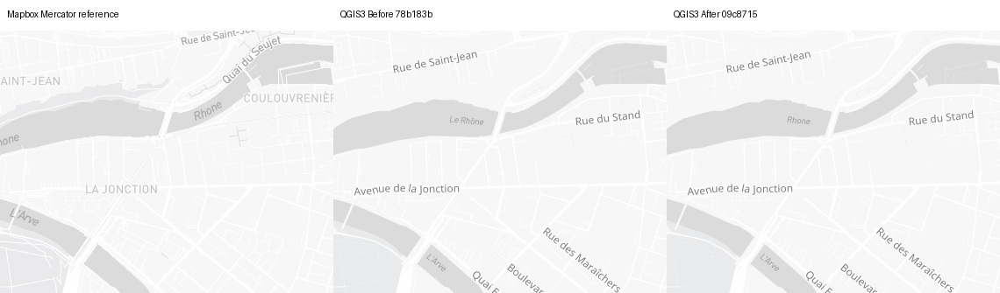
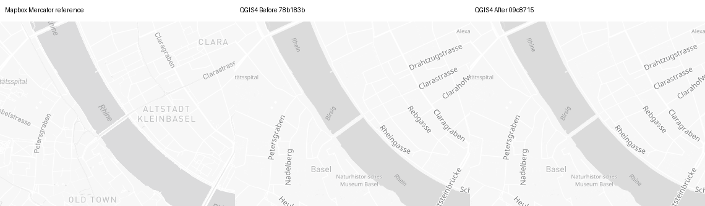
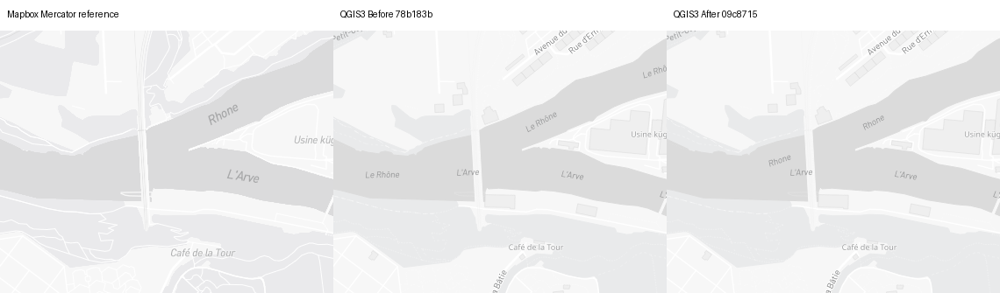

# Light waterway content — #1462

Fresh 2026-09-15 source-backed correction, **not holistic completion**.
Before `78b183beb8d069f53d31bdec808a113c801a99d0`; captured After `09c87150404384f4d7134fffb599f1391a3fa7bf`.
All 233 non-test Python inputs are pinned in the baseline/candidate runtime hash files.
[Provenance](provenance.json) · [Cameras](cameras.json) · [Original source](source.json) ·
[Complete native inventory](audit3-after/audit.json) · [Named repeat pairs](repeat-controls.json) ·
[Registration](registration.json) · [Reference metrics](metrics.json) · [Placement records](placement-audit.json).

## Retained mechanism and independent verdicts

- **C19 source content PASS, scoped:** only the unique exact-Light waterway owner,
  natural_label/line/coalesce/no-transform, with the audited spacing generator.
  The actual generator resolves three clipped bands; source-owned generated-ID
  collisions decline repair. Native overrides/other styles/other roles remain unchanged.
  Explicit native name_en/name requests preserve missing/NULL fallback and intentional
  empty English. No blanket natural-label or new language policy is introduced.
- **C02/C17–C22 settings preservation PASS, scoped:** exactly three fields per runtime
  change among all39rules; preprocessing is byte-identical. Geometry/class/worldview,
  zoom13–14/15–16/17+, font/size/priority/placement/spacing settings are preserved.
  Native regression has24text cases and432eligibility cases per native build,
  including six ordinary/disputed waterway classes, worldview and geometry populations.
- **All-owner audit:** waterway15 synthetic mismatches→0; other70 remain unchanged.
  [Actual river-property replay](waterway-properties-qgis3.json) covers16 camera/property
  sets through all three bands:24Before mismatches→0After per runtime.
  All observed replay classes are river. Not unique rivers, canal/stream geographic
  coverage, native-decoder/fetch parity or zoom-equivalent eligibility proof.
- **C08/C20 reader association PARTIAL:** Rhone and Rhine remain associated with their
  rivers in Geneva/Basel bend and confluence detail. L’Arve/Birs/Birsig/Limmat retain
  local fallback. This is scoped visual inspection, not universal curved-label,
  shoreline/topology, canal/stream, long-name, RTL-shaping or per-glyph font validation.
- **C18/C21/reference fidelity OPEN:** native labels remain smaller/differently placed
  than the reference. Most changed cells improve MAE, but QGIS3 Baselz17 +0.003466%,
  Geneva z13.1 +0.035914%, and QGIS4 Baselz14 +0.000303% are repeatable increases.
  No difference is dismissed as noise or accepted as a permanent limitation.
  All non-waterway distinct names remain; QGIS3 confluencez15 loses17 curved placement
  records for one Rue de Saint-Jean duplicate (34→17 records), retaining the street name.
  [Explicit placement trade-off](confluence-road-tradeoff.png). Records are not unique labels.
- **C01/C23 remain OPEN:** source/native zoom differs. At requested Geneva12.9,
  QGIS3 renders integer13 (continuous12.818517), so pre-existing native waterway labels
  precede the source minimum13. Content repair does not fix activation or certify a pan.
- **C28/C29 PDF remain scoped/open:** corrected river text is visible in16actual
  production150DPI forced-vector PDFs, fixed338.667×238.125mm page, viewed96DPI.
  QGIS3's four repeat raster pairs match; QGIS4's Geneva Before/After differ129/62pixels,
  Basel449/222. [Named PDF pairs](pdf-audit.json). No PDF-file identity/noise claim.
  QGIS4 PDF detail/POI density and crowded confluence labels differ from PNG; no
  association/legibility or output-density pass is implied for that mode.

## Matched evidence

13views: seven Light presets, Basel14/17 and Geneva confluence15/12.9/13/13.1.
Both QGIS3.44.11/Qt5.15.17 and QGIS4.2.0/Qt6.9.2, 1280×900 EPSG:3857 PNG;
actual map DPI100/96 respectively. Requested and resolved waterway face is Barlow Italic.
Docker-installed open fonts are not bundled or registered by the plugin ZIP.

104native PNGs: all52Before/After repeat pairs match PNG/settings/context bytes
and normalized placement records. 52browser PNGs: all26repeat pairs match.
130actual browser-Mercator/native anchors are within1e-6px. Eight PDF-hook PNGs
and two portable-worker replay PNGs equal their ordinary counterparts; the30
named supplemental PNG/settings/context checks are in [supplemental identity](supplemental-identity.json).
Six Swiss preset views are Before/After pixel-identical in both builds; Geneva14 changes.

Fresh whole-source SHA256 `87413e46c074e13aef420958a3ad101961766e6645336608e399ceccaffc6d32` matches the previous source
and the pinned complete waterway owner. Source and preprocessed fingerprints are separate.
Live upstream vector-tile bytes are **not archived**; no frozen-provider parity claim.
Original source-globe references remain under `reference/`; `reference-mercator/`
is an explicitly labelled planar diagnostic, not a change to source intent.
All live captures used same-run protected Gateway/container HTTP200/TLS authorization,
unchanged inherited protected environment, and completed successfully. No blank/failed
capture, token copy, direct-token fallback, egress widening or TLS disable is counted.

## Representative native-size detail

Each panel is **Mapbox explicit-Mercator reference | QGIS Before | QGIS After**.
Unscaled380×300 map crops, plus35px caption strip. Full maps remain1280×900 per panel.



Geneva14, box `(140,380,520,680)`: Le Rhône becomes source-requested Rhone; L’Arve
is retained. [Full map](geneva-urban-z14-light-qgis3-full.png).



Basel14, box `(450,310,830,610)`: Rhein becomes Rhine along the bend.
[Full map](basel-rhine-z14-qgis4-full.png).



Confluence15, box `(380,360,760,660)`: Rhone and L’Arve remain distinguishable;
repetition/size still differ. [Full map](geneva-confluence-z15-qgis3-full.png).

Map data © OpenStreetMap contributors; reference cartography © Mapbox.

## Complete gallery and metrics

Positive relative Mercator MAE movement is worse, not a semantic score.

| Camera | QGIS3 full / crop | QGIS4 full / crop | QGIS3 MAEΔ% | QGIS4 MAEΔ% |
| --- | --- | --- | ---: | ---: |
| switzerland-alps-z5-light | [full](switzerland-alps-z5-light-qgis3-full.png) / [crop](switzerland-alps-z5-light-qgis3-crop.png) | [full](switzerland-alps-z5-light-qgis4-full.png) / [crop](switzerland-alps-z5-light-qgis4-crop.png) | +0.000000 | +0.000000 |
| zurich-region-z8-light | [full](zurich-region-z8-light-qgis3-full.png) / [crop](zurich-region-z8-light-qgis3-crop.png) | [full](zurich-region-z8-light-qgis4-full.png) / [crop](zurich-region-z8-light-qgis4-crop.png) | +0.000000 | +0.000000 |
| lausanne-lavaux-z10-light | [full](lausanne-lavaux-z10-light-qgis3-full.png) / [crop](lausanne-lavaux-z10-light-qgis3-crop.png) | [full](lausanne-lavaux-z10-light-qgis4-full.png) / [crop](lausanne-lavaux-z10-light-qgis4-crop.png) | +0.000000 | +0.000000 |
| bern-urban-z12-light | [full](bern-urban-z12-light-qgis3-full.png) / [crop](bern-urban-z12-light-qgis3-crop.png) | [full](bern-urban-z12-light-qgis4-full.png) / [crop](bern-urban-z12-light-qgis4-crop.png) | +0.000000 | +0.000000 |
| geneva-urban-z14-light | [full](geneva-urban-z14-light-qgis3-full.png) / [crop](geneva-urban-z14-light-qgis3-crop.png) | [full](geneva-urban-z14-light-qgis4-full.png) / [crop](geneva-urban-z14-light-qgis4-crop.png) | -0.540123 | -0.081294 |
| zurich-streets-z17-light | [full](zurich-streets-z17-light-qgis3-full.png) / [crop](zurich-streets-z17-light-qgis3-crop.png) | [full](zurich-streets-z17-light-qgis4-full.png) / [crop](zurich-streets-z17-light-qgis4-crop.png) | +0.000000 | +0.000000 |
| geneva-streets-z18-light | [full](geneva-streets-z18-light-qgis3-full.png) / [crop](geneva-streets-z18-light-qgis3-crop.png) | [full](geneva-streets-z18-light-qgis4-full.png) / [crop](geneva-streets-z18-light-qgis4-crop.png) | +0.000000 | +0.000000 |
| basel-rhine-z14 | [full](basel-rhine-z14-qgis3-full.png) / [crop](basel-rhine-z14-qgis3-crop.png) | [full](basel-rhine-z14-qgis4-full.png) / [crop](basel-rhine-z14-qgis4-crop.png) | -0.001996 | +0.000303 |
| basel-rhine-z17 | [full](basel-rhine-z17-qgis3-full.png) / [crop](basel-rhine-z17-qgis3-crop.png) | [full](basel-rhine-z17-qgis4-full.png) / [crop](basel-rhine-z17-qgis4-crop.png) | +0.003466 | -0.000084 |
| geneva-confluence-z15 | [full](geneva-confluence-z15-qgis3-full.png) / [crop](geneva-confluence-z15-qgis3-crop.png) | [full](geneva-confluence-z15-qgis4-full.png) / [crop](geneva-confluence-z15-qgis4-crop.png) | -0.155004 | -0.077314 |
| geneva-confluence-z12p9 | [full](geneva-confluence-z12p9-qgis3-full.png) / [crop](geneva-confluence-z12p9-qgis3-crop.png) | [full](geneva-confluence-z12p9-qgis4-full.png) / [crop](geneva-confluence-z12p9-qgis4-crop.png) | -0.748561 | -0.363606 |
| geneva-confluence-z13 | [full](geneva-confluence-z13-qgis3-full.png) / [crop](geneva-confluence-z13-qgis3-crop.png) | [full](geneva-confluence-z13-qgis4-full.png) / [crop](geneva-confluence-z13-qgis4-crop.png) | -0.143820 | -0.329993 |
| geneva-confluence-z13p1 | [full](geneva-confluence-z13p1-qgis3-full.png) / [crop](geneva-confluence-z13p1-qgis3-crop.png) | [full](geneva-confluence-z13p1-qgis4-full.png) / [crop](geneva-confluence-z13p1-qgis4-crop.png) | +0.035914 | -0.223857 |

## Actual PDFs

Reference PNG is context, not a browser PDF. Each PDF folder contains Before/After
originals, repeated exports, fixed96DPI rasterizations, extracted text and actual layout
settings. Placement JSON in these folders is from the companion PNG, **not PDF labeling results**.

| Extent | QGIS3 PDF detail / originals | QGIS4 PDF detail / originals |
| --- | --- | --- |
| geneva-confluence-z15 | [detail](geneva-confluence-z15-qgis3-pdf150-crop.png) / [Before](3/geneva-confluence-z15/before-pdf/pdf150.pdf) / [After](3/geneva-confluence-z15/after-pdf/pdf150.pdf) | [detail](geneva-confluence-z15-qgis4-pdf150-crop.png) / [Before](4/geneva-confluence-z15/before-pdf/pdf150.pdf) / [After](4/geneva-confluence-z15/after-pdf/pdf150.pdf) |
| basel-rhine-z14 | [detail](basel-rhine-z14-qgis3-pdf150-crop.png) / [Before](3/basel-rhine-z14/before-pdf/pdf150.pdf) / [After](3/basel-rhine-z14/after-pdf/pdf150.pdf) | [detail](basel-rhine-z14-qgis4-pdf150-crop.png) / [Before](4/basel-rhine-z14/before-pdf/pdf150.pdf) / [After](4/basel-rhine-z14/after-pdf/pdf150.pdf) |

## Reproduction and verification

Use the captured source and correct before/after qfit checkout, named `qfit`.
The portable worker checks all233non-test Python hashes and the source hash before
rendering. Use the recorded font-enabled image/runtime from `image-ids.json`, installed
Barlow/Noto faces, and authorized inherited credentials/proxy/CA; no token argv exists.
Gateway-managed runs must perform their own same-run protected host **and container**
preflights and keep the run alive. Local image IDs are provenance, not public pull tags.

```bash
QT_QPA_PLATFORM=offscreen PYTHONHASHSEED=0 python3 waterway_capture.py \
  --repo /checkout/qfit --evidence /evidence --mode native --qgis-major 3 \
  --camera geneva-confluence-z15 --variant after-replay-new
```

Use QGIS4 with `--qgis-major 4`; add `--pdf` for the exact archived production-setting
export hook. `--mode browser --projection source|mercator --chromium /path/to/chromium`
replays browser capture from the archived source; use a fresh evidence copy without
existing reference outputs when recapturing browser frames. Neither source reuse nor
the worker promises byte identity after upstream tile changes.

Offline audits require PyQGIS but no credentials/network: `audit.py REPO SOURCE OUTPUT`
and `waterway_property_audit.py EVIDENCE 3` (or4). `verify_evidence.py` verifies all
named matrix controls/registration/settings and regenerates only derived JSON/crops;
`pdf_audit.py` uses Poppler to rasterize the original PDFs at fixed96DPI and report
named pairs. The manifest hashes every intended artifact except itself.

No scope reduction or accepted limitation: seven other content owners, semantic
zoom/handoff, remaining road/boundary paint, rural/topology/seams, long/RTL shaping,
real activities/accessibility, packaged desktop, full atlas and map context remain
required in the repository C01–C30 ledger. The issue remains OPEN.

## Final review head

[Final-head verification](final-head-verification.json) records the exact review head,
233 runtime byte matches, documentation-only delta and completed local/native/package gates.
No fresh final-head recapture is claimed.

## Integration

[PR #1478](https://github.com/ebelo/qfit/pull/1478) merged 2026-09-15T12:01:11Z.
[Final checks, reviews, fresh Sonar and public-image verification](merged-gates.json)
record all11checks green, exact-head Codex clean/Greptile5/5 and zero unresolved
Sonar issues. Main `3436e3833f9603db17be3f707afc43a86432f5d8` is clean and its entire tree equals
reviewed `280a23596bf904e0ffc36c4fc3285180766ef67f`. The public Sonar read used the ordinary browser
route after the shell protected proxy denied that unrelated host; no Mapbox/proxy/
egress/TLS policy changed. All capture processes finished. **#1462 remains OPEN.**
